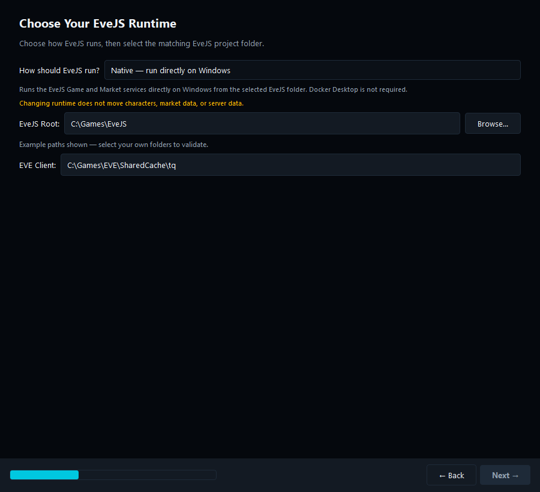
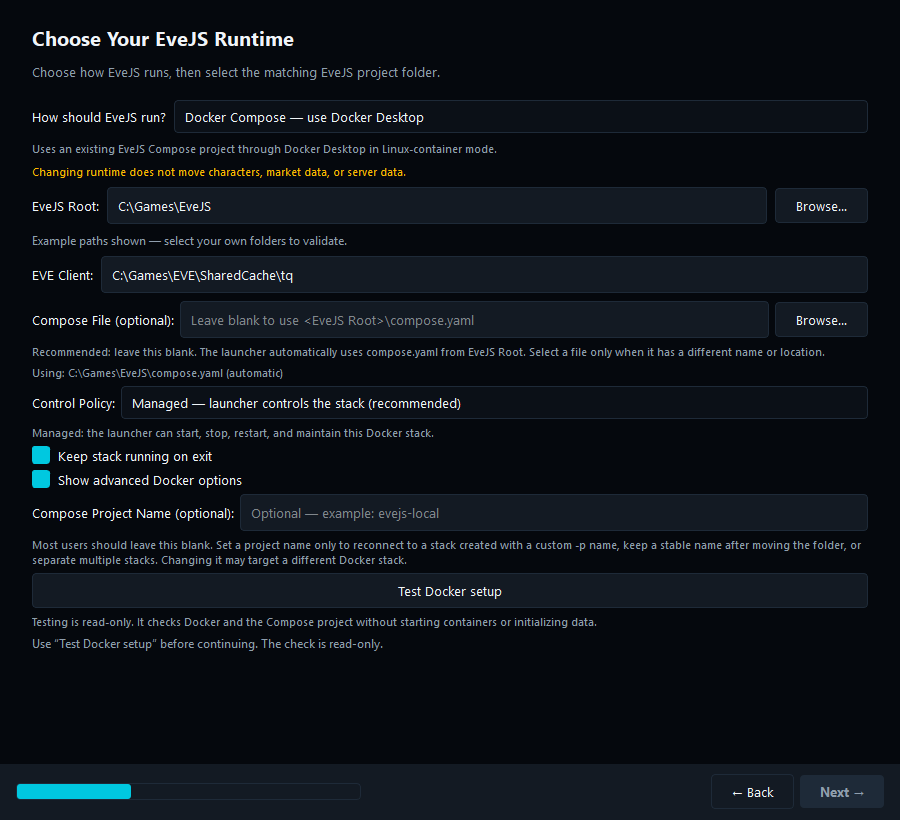
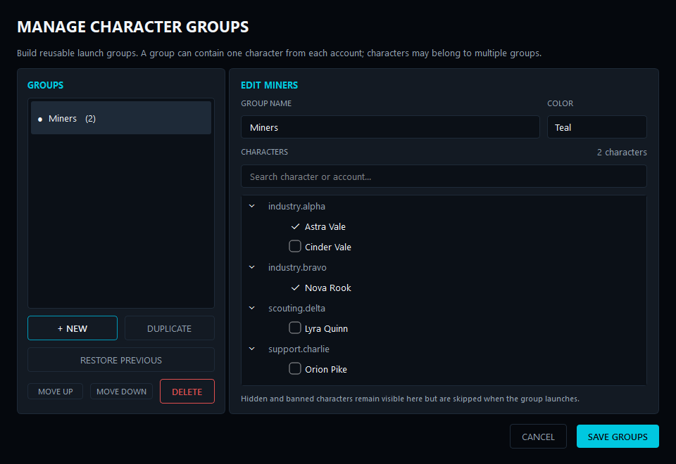
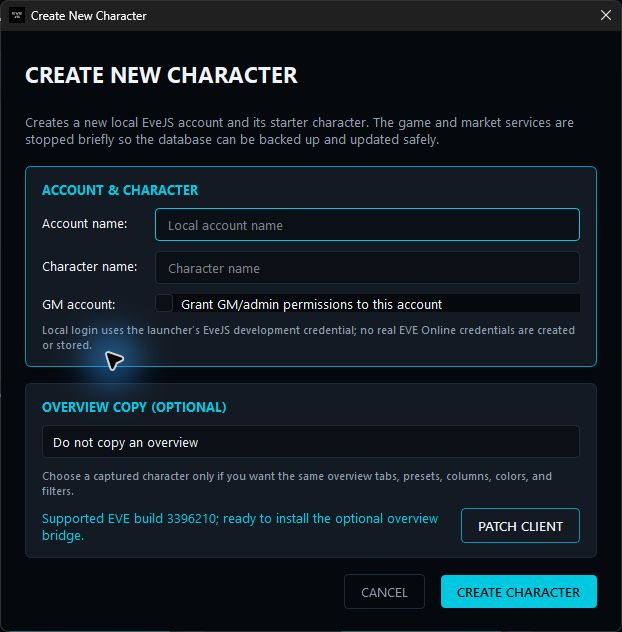
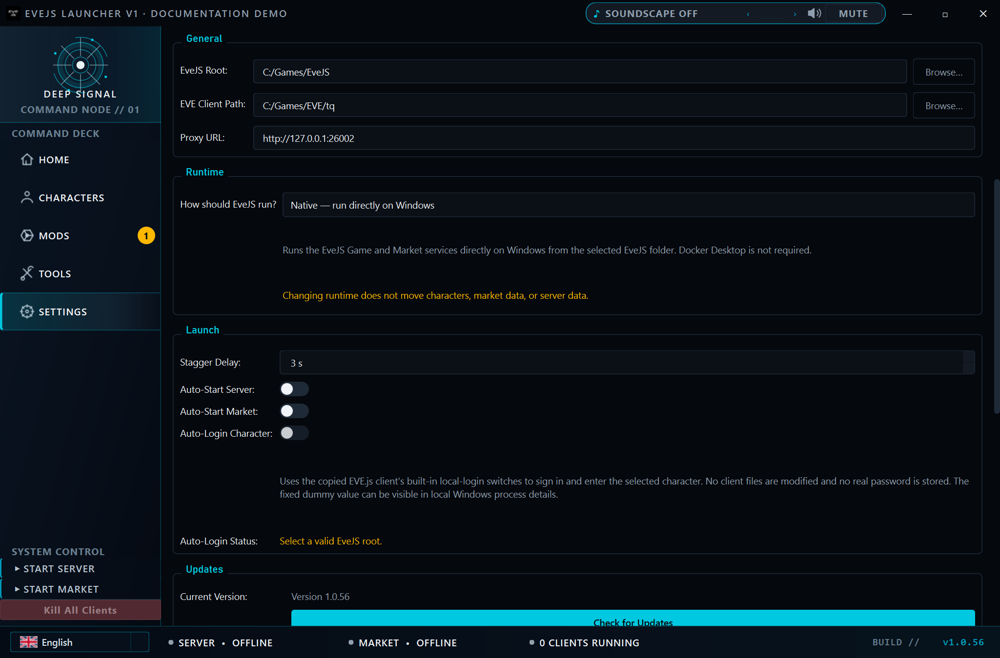
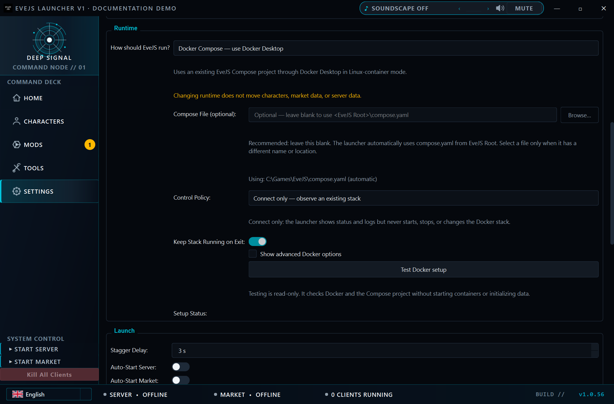
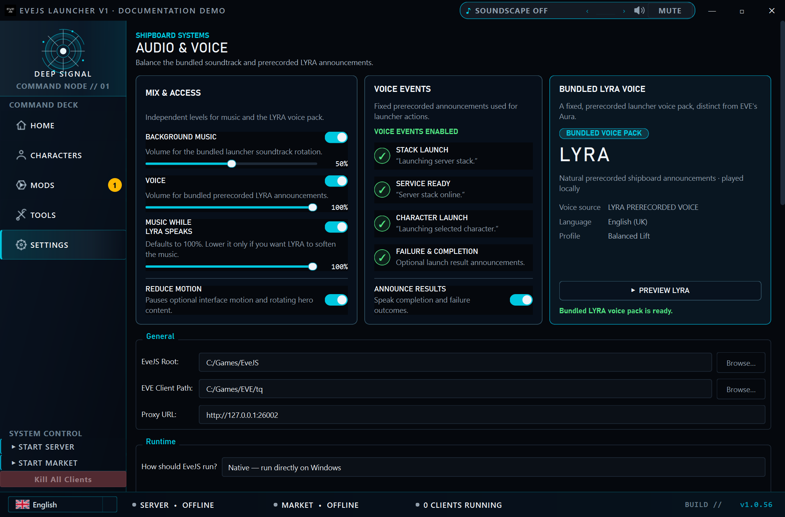
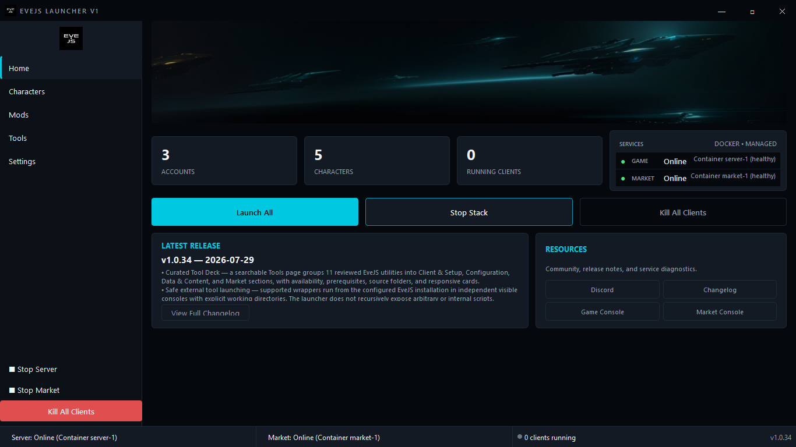

# EveJS Launcher

EveJS Launcher is a Windows desktop control panel for a local EveJS installation. It brings the game server, market server, EVE clients, character profiles, mods, maintenance tools, launcher updates, and local shipboard audio into one application, with an explicit choice between Native processes and Docker Compose.

[Download the latest release](https://github.com/V0nCleef/evejs-launcher/releases/latest) · [Read the release notes](https://github.com/V0nCleef/evejs-launcher/releases) · [Join the EveJS Discord](https://discord.gg/HVTfKeqX3t)


Home is the Deep Signal command network: authoritative Game and Market state, recent service activity, running-client telemetry, stack lifecycle controls, and selected-group launch controls.

## Start here

### What you need

- Windows 10 or Windows 11
- An existing EveJS checkout or Compose project
- An EVE client prepared for use with EveJS
- For Native runtime: Node.js and npm, plus Rust/Cargo or an already-built Market Server binary
- For Docker runtime: Docker Desktop in Linux-container mode with Docker Compose v2

### Native or Docker?

| Choose | What it does | Best for |
|---|---|---|
| **Native** | Runs the EveJS Game and Market services directly on Windows from the selected EveJS folder. Docker Desktop is not required. | A traditional EveJS installation already run from Windows. |
| **Docker Compose** | Uses an existing EveJS Compose project through Docker Desktop in Linux-container mode. | An EveJS project that already includes `compose.yaml` and Docker support. |

Changing runtime does not move characters, market data, or server data between Native and Docker. Choose the setup your EveJS project already uses. The launcher never switches the runtime automatically.

### Install the launcher

1. Open the [latest release](https://github.com/V0nCleef/evejs-launcher/releases/latest).
2. Download `EveJS-Launcher-V1.zip`.
3. Extract the complete `EveJS-Launcher-V1` folder.
4. Run `EveJS-Launcher-V1.exe` from inside that folder.
5. On first launch, select the root folder and explicitly choose **Native** or **Docker Compose**.

Keep the `_internal` folder beside the executable. The release is a portable application folder, not a single standalone executable. Python is not required when using a release build.

### First launch

The setup wizard explains both runtimes and validates the selected backend before it writes configuration. Native keeps the existing installation checks. Docker accepts a pristine Compose project before generated certificates or databases exist, then runs a read-only check of Docker Desktop, Compose, required services, loopback endpoints, current containers, and initialization state.

1. Choose **Native** or **Docker Compose** in the wizard. The launcher may recommend Docker when a Compose file is present, but never switches the selection automatically.
2. Select the EveJS Root folder.
3. For Native, select the supported vanilla/modded start indicator or keep **Always ask**.
4. For Docker:
   - Normally leave **Compose File** blank; the launcher automatically uses `<EveJS Root>\compose.yaml`.
   - Normally leave **Compose Project Name** blank. The advanced field is only for an existing custom name, a stable name after moving the folder, or multiple separate stacks.
   - Choose **Managed** when the launcher should control the stack, or **Connect only** when another tool already controls it.
   - Use **Test Docker setup**. **Next** remains unavailable until the exact current fields pass.
5. Finish setup, then use **Start Stack** on Home to start Market followed by Game.
6. Wait for both services to report **Online**.
7. Open **Characters** and launch the account you want to use.
8. Either enter the password in the EVE client, or enable **Auto-Login Character** under Settings → Launch when the launcher reports that the selected Native client is compatible. Real account passwords are never stored.

#### Native setup example



Native runs Game and Market directly on Windows. Select the EveJS project and EVE client folders; Docker Desktop is not required.

#### Docker Compose setup example



Docker uses an existing EveJS Compose project. The normal setup leaves **Compose File** and **Compose Project Name** blank, selects the desired control policy, and runs the read-only setup test before continuing.

## Interface tour

The launcher has five navigation pages. The captures below show v1.0.38 in one isolated documentation run. Real character and account labels are blurred in memory before capture, setup fields use generic example paths, and the displayed Online states are simulated without starting services.

### Home

Home combines service controls and status in one place. Game and Market are tracked independently through Offline, Starting, Online, Stopping, and Failed states. A service started outside the launcher is detected as externally managed and is never force-stopped by the launcher.

The screenshot at the top of this page uses a simulated healthy Native observation; the Docker example below uses the same safe presentation approach. No server process or container was started to create either image.

### Characters


Characters are read from the configured EveJS installation and grouped into account-aware cards. Each card shows the portrait, wallet balance, ship, launch state, and account state. Selecting a card opens the detail panel with skill points, location, security status, and launch controls. The New Character tile supports Native and compatible Managed Docker Compose projects; creation remains disabled in Connect-only mode.



Groups are completely user-configurable. Create and rename groups, add or remove any character, then select a group on Home or Characters to launch its eligible accounts. The launcher still prevents two characters on the same account from being launched at the same time.



On Native and compatible Managed Docker Compose installations, New Character accepts an account name, character name, optional GM status, and an optional captured overview source. Overview transfer uses an opt-in, reversible bridge that is installed only for the exact supported EVE client build 3396210. When a source still needs capture, launch that source once through the launcher, then launch the new character to apply the queued copy.

The character card menu can hide a character without touching game data, assign it to groups, or begin deletion. Character/account deletion is Native-only, requires Game, Market, and all EVE clients to be offline, creates a scoped backup, and requires typed confirmation before any database change.

### Mods


The Mod Manager scans reviewed loader and source-integration contracts and shows each discovered mod's configured and verified runtime state. A successful toggle changes configuration only; it is not reported as runtime-effective until the restarted Game server provides the exact expected evidence. **Apply & Restart Server** routes through the same server-mode selection used by every other start path.

A source-integrated mod installed by a launcher-compatible Setup also has **Remove** on its row. The v2 provider binds the exact `unins000.exe`, `unins000.dat`, recovery bundle, helper, active journal, and post-removal inventory by SHA-256. Removal is serialized against compatible Setup and direct uninstall runs, stops launcher-owned Game and Market processes, then runs the verified uninstaller with an explicit choice to keep saved data or quarantine local mod data. The launcher checks every enrolled integration path before reporting success, and the stack remains stopped afterward. Source-integrated mods installed another way are marked **External**; run that mod's matching compatible Setup once to enroll its removal kit. Legacy loader-only mods remain toggleable but cannot enroll the current removal provider. Windows **Installed apps** is only a fallback, not the normal removal path.

The current v2 installer provider supports one installation of a given mod per Windows user. Launcher removal binds the verified child to the exact selected EveJS root and refuses divergent provider registry roots before touching files. To move that mod to another EveJS root, remove it from the original root first, select the other root in the launcher, and run Setup again.

Mod authors should use the complete [EveJS Launcher mod authoring and integration guide](docs/MOD_AUTHORING.md). It documents supported layouts, the schema-v2 manifest, disabled-state boundary, runtime attestation, installer transactions, launcher-managed removal, testing, and the current limits of EveJS's upstream extension mechanisms.

### Tools


Tool Deck exposes a reviewed set of utilities from the configured EveJS `tools` folder. It supports text search, category filtering, prerequisite labels, wrapper availability, and responsive one- or two-column layouts.

The launcher does not recursively expose arbitrary scripts. It resolves only known top-level wrappers, opens them in independent visible consoles, and asks for confirmation before destructive or system-changing actions.

### Settings

#### Native runtime



*v1.0.38 Native Runtime settings. Game and Market run directly on Windows, and Docker Desktop is not required.*

#### Docker Compose runtime



*v1.0.38 Managed Docker Runtime settings. Compose File is blank so `<EveJS Root>\compose.yaml` is selected automatically; the advanced Project Name is also optional and blank.*

#### Audio and LYRA



The Audio & Voice panel controls the bundled **Celestial Transit** track, optional user-selected local music, and local prerecorded launcher announcements. LYRA is distinct from EVE's Aura: v1.0.38 ships an English (UK) prerecorded catalog using the **Balanced Lift** profile. Music and voice can be enabled and balanced independently, event announcements and ducking remain optional, and **Preview LYRA** verifies the bundled voice locally.

Settings covers the EveJS root, EVE client path, proxy address, Native/Docker runtime selection, Compose target and control policy, launch timing, service auto-start, compatible local auto-login, soundtrack and LYRA controls, motion preferences, update checks, server-mode selection, hidden characters, and local-data cleanup.

## What the launcher manages

| Area | Behaviour |
|---|---|
| Runtime backend | Persists Native, Managed Docker Compose, or read-only Connect-only Docker operation without silent switching. |
| Game service | Starts Node.js directly in vanilla or modded mode and reports lifecycle state. |
| Market service | Starts the market service before Game when the complete stack is requested. |
| Docker target | Resolves effective services, health, endpoints, mounts, data sources, and capabilities from one selected Compose project. |
| EVE clients | Creates account-specific profiles, launches clients through the local proxy, optionally performs verified local auto-login, and tracks running state. |
| Bulk launch | Launches all visible characters or a selected user-defined group serially with a configurable delay; remaining queued launches can be cancelled. |
| Characters | Reads character data and current portraits; supports search, hiding, grouping, Native creation with optional GM/overview copy, and backup-first deletion. |
| Mods | Discovers reviewed activation contracts, toggles state, removes installer-enrolled mods, and restarts Game when requested. |
| Tools | Resolves 11 reviewed external utility wrappers with prerequisite and risk information. |
| Audio and voice | Plays the bundled **Celestial Transit** track or user-selected local music, with local prerecorded LYRA announcements and separate volume, event, ducking, and preview controls. |
| Languages | Switches the complete launcher interface live between English, Simplified Chinese, Japanese, Korean, French, German, Dutch, and Russian. |
| Updates | Checks GitHub Releases, downloads the release ZIP, shows progress, stages replacement, restarts, and cleans validated update artifacts. |

## Service startup and detection

EveJS installations may include more than one `StartServer*.bat` file. The launcher uses those filenames as mode indicators:

- `StartServer.bat` means vanilla mode.
- `StartServerWithMods.bat` means modded mode.
- With more than one supported indicator, Settings can save a default or keep **Always ask**.
- With one supported indicator, that mode is selected automatically.

The batch files are not executed. They may contain interactive prompts that do not behave correctly inside a GUI launcher. Game is always started through Node.js directly with an explicit mode.

When **Start Stack** is used, Market is started first and Game waits for the required readiness state. Controls remain responsive while startup and shutdown checks run in background workers.

If an already-running Game or Market endpoint is detected, it is shown as externally managed. The launcher can use that service but will not claim ownership or terminate it.

### Docker Compose runtime



*Documentation capture using generic account totals and a simulated healthy service observation. The controls and status presentation are the production UI.*

Docker is a persisted runtime backend, not an automatic fallback. The launcher never silently switches a Native installation to Docker or changes an unselected Compose project.

Configure it under **Settings → Runtime**:

1. Set **How should EveJS run?** to **Docker Compose**.
2. Set **EveJS Root** to the absolute Compose project directory.
3. **Leave Compose File blank in the normal setup.** The launcher automatically uses `<EveJS Root>\compose.yaml`. Select an absolute file only when it has a different name or location.
4. Choose **Managed** when the launcher should start, stop, restart, and maintain the stack. Choose **Connect only** to observe an existing stack without changing it.
5. **Leave Compose Project Name blank in the normal setup.** Docker Compose will choose it automatically. The advanced override is useful only to match a stack created with a custom `-p` name, keep a stable name if the folder moves, or separate multiple stacks. A different name may target or create a different stack.
6. In Managed mode, choose whether the stack should remain running when the launcher exits.
7. Select **Test Docker setup**. Testing never saves, starts containers, or initializes data. Selecting **Save** with an untested or edited Docker draft runs the same read-only preflight first and writes only after that exact draft succeeds.

The preflight requires Docker Desktop in Linux-container mode, the Compose v2 plugin, and effective `server` and `market` services. All published EveJS endpoints must bind to loopback (`127.0.0.1` or `::1`). Optional `init` and tools-profile `market-tools` services enable the matching Tool Deck actions when present.

A valid pristine project is reported separately from runtime readiness and data initialization. Preflight never builds, starts, initializes, or seeds anything. Game-data initialization and Market seeding/rebuild are separate Managed actions with separate confirmation; no seed preset is chosen automatically. Connect-only mode explains what must be performed externally and remains observational.

| Policy | Observation | Lifecycle and tools | Window close |
|---|---|---|---|
| **Connect only** | Services, health, effective endpoints, mounts, data sources, and logs | All container, mod, and Docker Tool Deck mutations are disabled | Never stops the Compose stack |
| **Managed** | Same read-only observation | Start, stop, restart, force-recreate, supported mod activation, and reviewed Docker Tool Deck actions | Honors **Keep Stack Running on Exit**; otherwise stops Game before Market |

Managed lifecycle work, Compose inspection, log streaming, setup preflight, and container-side tools run on workers rather than the Qt GUI thread. Status is based on Compose state and health: a healthy running service is Online, an unhealthy service is Failed, and an intentionally exited service is Offline with its exit code retained for diagnostics. When a required service has no health check, Game becomes Online only after its effective Game TCP endpoint and Proxy `/health` respond; Market requires its effective `/health` endpoint.

#### Managed Docker character creation

New Character is available only in **Managed** Docker mode; Connect-only remains read-only, and character/account deletion remains Native-only. Close every EVE client before starting. The launcher records the prior service state, temporarily stops the selected Compose stack, creates and verifies a scoped game-store backup, creates the account and character, verifies the character and rookie ship, and checks for unexpected data changes. If creation or verification fails, it attempts and verifies a rollback from that backup. Services that were previously online are restored only after success or a confirmed rollback and maintenance-lease release; if safety cannot be confirmed, the backup is retained and the stack stays offline.

This mutation path has a strict compatibility gate. It accepts only the reviewed EveJS v0.12.5 `server`, `market`, and `init` Compose layout with no extra effective services, the supported game-store mount, `pull_policy: never`, and the expected runtime package and API fingerprints. The selected project and container contract are revalidated immediately before maintenance begins, so an unsupported or changed target fails before game data is modified.

#### Docker endpoints

The launcher reads effective host publications from Compose and carries the complete endpoint set through monitoring, portraits, data access, and client launch. Remapped host ports are supported; the client does not fall back to Native defaults when Docker endpoint authority is unavailable.

| Endpoint | Typical host port | Compose container target |
|---|---:|---:|
| Assets | 443 | 26003 |
| XMPP | 5222 | 5222 |
| Game | 26000 | 26000 |
| Images | 26001 | 26001 |
| Proxy | 26002 | 26002 |
| Market HTTP and health | 40110 | 40110 |

Market RPC `40111` is used by Native status checks and normally remains private inside the Docker network.

#### Docker mods and Tool Deck

In Managed mode, applying mods creates a deterministic launcher-owned Compose override. It mounts the reviewed mod directory and preloads selected `mods/*/loader.js` files in visible order through `NODE_OPTIONS`. Connect-only mode can inspect the selected project but cannot change its mod or Compose state.

When the effective project provides the required services, the Docker Tool Deck exposes only reviewed semantic actions: database initialization; Market status, doctor, backup inventory, backups, preset inventory, snapshot information, fixed v1 rebuild presets, v2 rebuild, and latest-backup restore. Actions revalidate the selected target immediately before execution. Operations that change Market data require both Game and Market to be stopped, and arbitrary container commands are never accepted from the UI.

<details>
<summary>Service ports and readiness checks</summary>

| Port | Purpose |
|---:|---|
| `443` | Typical Docker host publication for assets |
| `5222` | XMPP |
| `26000` | Game TCP endpoint used by EVE clients |
| `26001` | Image service in EveJS v0.12.3; legacy layouts may differ |
| `26002` | Local HTTP proxy used by launched clients |
| `40110` | Market HTTP administration endpoint |
| `40111` | Market RPC used for Native readiness; normally private in Docker |

Native Market readiness is checked against port `40111`, not `26001`. Port `26001` is the image service in EveJS v0.12.3 and can be reachable while Market is offline. Docker uses Compose health plus host HTTP `40110`; it does not require host publication of `40111`.

</details>

## Client profiles and launching

Each account receives an isolated launcher profile under:

```text
%APPDATA%\EveJS-Launcher\Profiles\<account>\tq
```

On Windows these profiles use directory junctions rather than copying the complete EVE client. The launcher prepares the minimum settings required by the client, pre-fills the account username, points traffic at the configured local proxy, and launches the selected EVE executable.

Real passwords are never stored or typed by the launcher. By default, password entry remains inside the EVE client.

For the exact supported Native EVE client build 3396210, Settings can enable **Auto-Login Character** after the launcher verifies the required client code and EveJS local password-bypass configuration. This opt-in path sends a fixed development credential only to the configured loopback EveJS service; the fixed value may be visible in the local process command line, but it is not a real account password. Unsupported or changed clients keep normal manual login.

**Launch All** and selected-group launch use a serial queue instead of opening every client at once. The configured stagger delay is applied between accounts, the application stays responsive, and cancelling the queue stops only future launches. Clients that already started remain open. Group membership is stored in launcher configuration by stable account/character identity.

## Mod handling

The launcher supports two explicit contracts. Loader mods are discovered under `<evejs>/mods` and toggle by renaming their preload. Source-integrated schema-v2 mods are discovered under `<evejs>/server/mods` and toggle through a validated top-level Boolean in `<evejs>/config/mods`. Arbitrary source patches are not guessed at or presented as safely toggleable.

This is a launcher-side management framework around existing EveJS loading mechanisms, not a universal upstream EveJS plugin API. Disabled loader code is not loaded; a disabled source-integrated mod keeps only its tiny configuration/status gate active and must return before loading gameplay code or touching state.

Use **Apply & Restart Server** when the new configured mod state should become effective. The restart uses the same saved or prompted vanilla/modded selection as Home, client-triggered auto-start, and the navigation controls. Configured enabled does not by itself prove that the current Game server loaded the mod.

In Managed Docker mode, Apply & Restart instead regenerates the launcher-owned Compose override from the visible ordered selection and recreates Game with those preloads. Connect-only mode never changes loader or Compose state.

Managed Docker writes a durable transaction marker before replacing its exact launcher-owned override. If the launcher or computer stops during that handoff, ordinary Docker start/restart operations fail closed instead of consuming an uncertain override. Return to **Mods**, keep the same visible toggle selection, and press **Apply & Restart Server** again to resume the exact transaction. If the override no longer matches either its enrolled prior or desired hash, leave the launcher-owned files untouched and repair the artifact; the launcher deliberately refuses to guess.

See the [mod authoring and integration guide](docs/MOD_AUTHORING.md) for the complete compatibility and packaging contract.

## Tool Deck catalogue

Tool Deck currently recognises 11 reviewed wrappers. Availability is resolved from the selected EveJS installation; the tools are not bundled into the launcher.

<details>
<summary>View the complete tool catalogue</summary>

| Category | Tool | Notes shown by the launcher |
|---|---|---|
| Client & Setup | Client Setup Wizard | Prepares client paths, certificates, `blue.dll`, and `start.ini`. |
| Client & Setup | Blue DLL Patcher | Opens the guided patcher for a selected client DLL. |
| Client & Setup | Client Code Grabber | Requires Python; extracts and processes client code. |
| Configuration | Server Config Editor | Docker Desktop is required for containerized installations. |
| Data & Content | Local Database Creator | Downloads SDE data and generates local database content. |
| Data & Content | Reset Local Databases | Includes a non-destructive preview and confirmation before reset. |
| Data & Content | New Eden Store Editor | Requires Python; edits store catalogue and configuration data. |
| Market | Market Seed Builder | Opens an interactive build, smoke-check, and diagnostics menu. |
| Market | Market Seed Builder GUI | Opens graphical market-seed build and diagnostics controls. |
| Market | TQ Market Snapshot Seeder v2 | Builds and inspects public market snapshot seed data. |
| Market | Rust & MSVC Market Setup | May request Administrator permission and change the system toolchain. |

Every launch request is re-resolved against the current EveJS root before a process is created. Destructive and system-level actions are confirmed at the final launch boundary rather than relying only on the visible card state.

</details>

## Updates

The launcher checks the latest GitHub Release on startup when automatic checks are enabled. Manual checks are available in Settings.

For an update, the launcher:

1. Downloads the release ZIP with visible byte progress.
2. Extracts and validates the new application folder in a staging location.
3. Keeps the update window open while the old launcher exits.
4. Moves only the launcher-owned executable and `_internal` runtime into a private rollback directory.
5. Copies and verifies only those two launcher-owned entries from the new onedir installation.
6. Restarts the new executable.
7. Removes only the validated staging and rollback artifacts after successful restart.

The launcher folder is treated as a shared directory: every pre-existing file or folder outside the launcher executable and `_internal` is left in place, including a colocated EveJS installation. Update cleanup metadata lives inside the launcher-owned `_internal` directory; a private rollback directory may exist temporarily while an update is being verified. The executable and `_internal` must still remain together because they form the complete launcher application.

## Language and Unicode paths

The language selector sits in the bottom footer/status bar and in the first-run wizard. Each option uses a painted flag and its native language name, so it does not depend on emoji-font support. On a fresh profile, the launcher selects a supported system language automatically; otherwise it falls back to English, and a saved choice always wins. English, Simplified Chinese, Japanese, Korean, French, German, Dutch, and Russian cover the complete launcher interface, including the first-run wizard, main pages, Settings, dialogs, updater, and LYRA text captions. User data, server messages, paths, raw log output, and semantic combo-box values are deliberately preserved instead of being mistaken for translatable interface text.

Launcher-owned paths use Windows Unicode APIs. Client discovery accepts UTF-8, UTF-8 with BOM, UTF-16 with BOM, and the active Windows legacy code page for `EvEJSConfig.bat` without discarding undecodable bytes. Real profile, AppData, temp, EveJS, and client paths remain unchanged when they contain Chinese, Japanese, Korean, or other non-ASCII characters.

If a Docker project directory has no usable ASCII-derived name and the Compose file has no top-level `name`, set **Compose Project Name** to the stack's existing lowercase ASCII name, such as `evejs-local`. The launcher never invents a different stack identity automatically.

## Configuration reference

Configuration is stored in:

```text
%APPDATA%\EveJS-Launcher\config.json
```

| Setting | Purpose | Default |
|---|---|---|
| EveJS Root | Installation containing the server, mods, tools, and game data | Not set |
| EVE Client Path | Copied EVE client `tq` folder containing `start.ini` and `bin64/exefile.exe` | Detected during setup when possible |
| Proxy URL | Local client-traffic proxy | `http://127.0.0.1:26002` |
| Runtime Backend | Native processes or Docker Compose | Native |
| Docker Compose File | Absolute primary Compose file | Not set |
| Docker Control Policy | Read-only observation or launcher-managed lifecycle | Connect only |
| Docker Project Name | Optional explicit Compose project identity | Empty |
| Keep Stack Running on Exit | Leaves a Managed Compose stack running when the launcher closes | On |
| Stagger Delay | Delay between queued client launches | `3 seconds` |
| Auto-Start Server | Starts Game when a client requires it | Off |
| Auto-Start Market | Starts Market when required | Off |
| Auto-Login Character | Uses the verified local auto-login path for a compatible Native client | Off |
| Server Start Selection | Always ask or a detected vanilla/modded indicator | Always ask |
| Launcher Language | Saved language for the complete launcher interface | English |
| Music | Enables bundled **Celestial Transit** and configured local music | On |
| Music Volume | Playback level for launcher music | `50%` |
| LYRA Voice | Enables bundled prerecorded launcher announcements | On |
| LYRA Voice Volume | Playback level for LYRA announcements | `100%` |
| Announce Results | Announces supported completion and failure events | On |
| Music Ducking | Adjusts music while LYRA announcements play | On |
| Animations | Deep Signal traffic, signal motion, and page effects | On |
| Hero Rotation Interval | Time between Home banner images | `6 seconds` |
| Auto-Check for Updates | Periodic GitHub Release checks | On |
| Update Check Interval | Time between automatic checks | `6 hours` |
| Hidden Characters | Characters omitted from the normal grid | Empty |
| Character Groups | User-defined launch groups and selected group | Empty / All Visible |

Settings are written atomically. If the stored configuration is malformed, the launcher backs it up and recovers with defaults rather than continuing with a partially loaded file.

## Common questions

<details>
<summary>Why does a service say it is managed externally?</summary>

The endpoint is reachable, but the process was not started by this launcher instance. The launcher reports the service and can continue using it, but it will not terminate a process it does not own. Stop it from the console or application that originally started it.

</details>

<details>
<summary>Why is Auto-Login Character unavailable?</summary>

Auto-login is deliberately build-gated. It is available only for Native runtime when the selected EVE client is the exact supported build 3396210, the required code entries match their known hashes, the local proxy is loopback-only, and EveJS has local development password validation bypass enabled. Settings shows the failed capability check; unsupported clients are not modified.

</details>

<details>
<summary>How does overview copy work for a new character?</summary>

The optional overview bridge is installed from the New Character dialog only after exact client build and hash checks. It first preserves the original client archive entry and can be removed later. Select a source character whose overview has already been captured, or launch the source once through the launcher after creating the new character. The queued overview is imported when the new character next logs in through the launcher.

</details>

<details>
<summary>Why are Docker controls disabled or the project unavailable?</summary>

Use **Test Docker setup** for an actionable result. If the Docker CLI is missing, install Docker Desktop or add `docker.exe` to `PATH`. If the CLI exists but the engine is unavailable, start Docker Desktop and wait for its Linux-container engine. A separate result identifies a missing Compose plugin, invalid Compose configuration, or missing required `server` and `market` services. Required host endpoints must publish on loopback only; wildcard or LAN-facing bindings are rejected.

Connect-only mode deliberately disables all container, mod, and Docker Tool Deck mutations. Select **Managed** only when this launcher should control the chosen project. An unhealthy service remains running but reports Failed; inspect its launcher console and Compose health check before deciding whether to restart or recreate it.

</details>

<details>
<summary>Why did a mod change not take effect?</summary>

Mod toggles change configured state on disk; they do not change an already-running Game server. **Apply & Restart Server** performs the required restart and runtime verification through the normal server-mode resolver. In Managed Docker mode, an interrupted Apply leaves ordinary lifecycle operations blocked: keep the same visible toggles and press **Apply & Restart Server** again to resume the exact transaction.

</details>

<details>
<summary>Why is a tool marked unavailable?</summary>

Tool Deck checks the configured EveJS root and the known wrapper path under its `tools` folder. Use Refresh after changing the root or adding a tool. An inaccessible wrapper disables only that card; it does not break the rest of the page.

</details>

<details>
<summary>Why is a character portrait missing?</summary>

Portraits are generated by the EveJS server and are not stored in the main game database. After moving or upgrading an EveJS installation, copy the generated Character image directory as well or let the server regenerate the portraits.

</details>

<details>
<summary>Can I move the executable out of the extracted folder?</summary>

No. The current release uses PyInstaller onedir packaging. Run the executable with its `_internal` directory beside it.

</details>

## Running from source

Python 3.11 or newer is recommended.

```text
git clone https://github.com/V0nCleef/evejs-launcher.git
cd evejs-launcher
python -m venv .venv
.venv\Scripts\activate
python -m pip install -r requirements.txt
python main.py
```

The full developer repository also contains automated tests. In that checkout,
install its development requirements before running:

```text
python -m pytest
```

<details>
<summary>Project layout</summary>

```text
main.py                     Application entry point
src/app.py                  Main window and application wiring
src/config.py               Atomic JSON configuration storage
src/core/                    Service, client, character, group, overview, database, mod, and tool logic
src/pages/home_page.py       Runtime dashboard
src/pages/characters_page.py Character grid and detail panel
src/pages/mods_page.py       Mod discovery and toggles
src/pages/tools_page.py      Curated external Tool Deck
src/pages/settings_page.py   Configuration and maintenance controls
src/widgets/                 Shared PyQt6 controls and panels
src/workers/                 Background character, patch, database, portrait, and service work
src/updater/                 Release checks, progress UI, and staged replacement
tests/                       Automated regression and layout coverage
```

The application is built with PyQt6 and packaged for Windows with PyInstaller in onedir mode.

</details>

## Project status

The launcher is Windows-only. Releases are published as portable ZIP archives on the [Releases page](https://github.com/V0nCleef/evejs-launcher/releases).

Bug reports and focused pull requests are welcome. When reporting a service problem, include the launcher version, which service failed, whether it was started inside or outside the launcher, and the relevant console output. Do not include account names, character names, passwords, or tokens in public reports.

## Optional DLSS5 package

DLSS5 is a separate optional project, not bundled with this launcher. Updating
the launcher does not install DLSS5 or change the renderer for users without it.
See [EveJS-DLSS5](https://github.com/V0nCleef/EveJS-DLSS5) for its package,
supported client build, requirements and separate component licence notices.

For launcher-managed installation, extract the complete `DLSS5` folder into
the selected EveJS root's `mods` directory and refresh Mods. The enabled package
is detected automatically. Dependencies are prepared on the first client launch,
not on server startup; that first launch can take longer while downloads and
verification complete. Use its Mods-page Uninstall action with all clients
sharing that physical client folder closed. Keep the retained rollback state.

The standalone installer remains available for users who use `Play.bat`, and a
verified standalone installation can also be launched here without creating a
Mods entry. Do not stack separate installations on the same physical client.
An incomplete or unknown DLSS5 installation is reported rather than guessed safe.

## Matching source and build

Each published binary must be accompanied by the matching source revision or
source archive and clear source access on the release page. The source package
contains `src`, `main.py`, `build.spec`, `build_support.py`, required repository
assets, licence files and dependency requirements. Do not build from an unrelated
branch and assume it matches a downloaded executable.

The candidate build uses Python 3.11.15, PyInstaller 6.21.0 and the dependency
versions listed in `THIRD_PARTY_NOTICES.md`. From a clean Windows environment
with those dependencies installed, run `python -m PyInstaller build.spec` from
the source root. Distribute the complete resulting onedir folder, including
`_internal`, not its EXE alone. This is a build recipe, not a byte-identical
reproducible-build guarantee.

## License

EveJS Launcher is free and open-source software licensed under the [GNU General Public License version 3](LICENSE). You may use, copy, modify, and redistribute it, including commercially, under the GPLv3 terms. Distributed modified versions must keep the same freedoms and provide their corresponding source.

Packaged dependency licenses and source links are listed in [THIRD_PARTY_NOTICES.md](THIRD_PARTY_NOTICES.md).

EVE Online and EVE are registered trademarks of CCP hf. This project is not affiliated with CCP Games.
