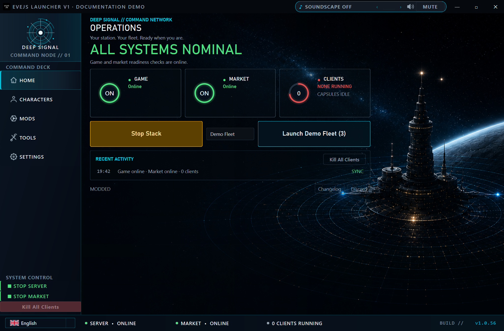
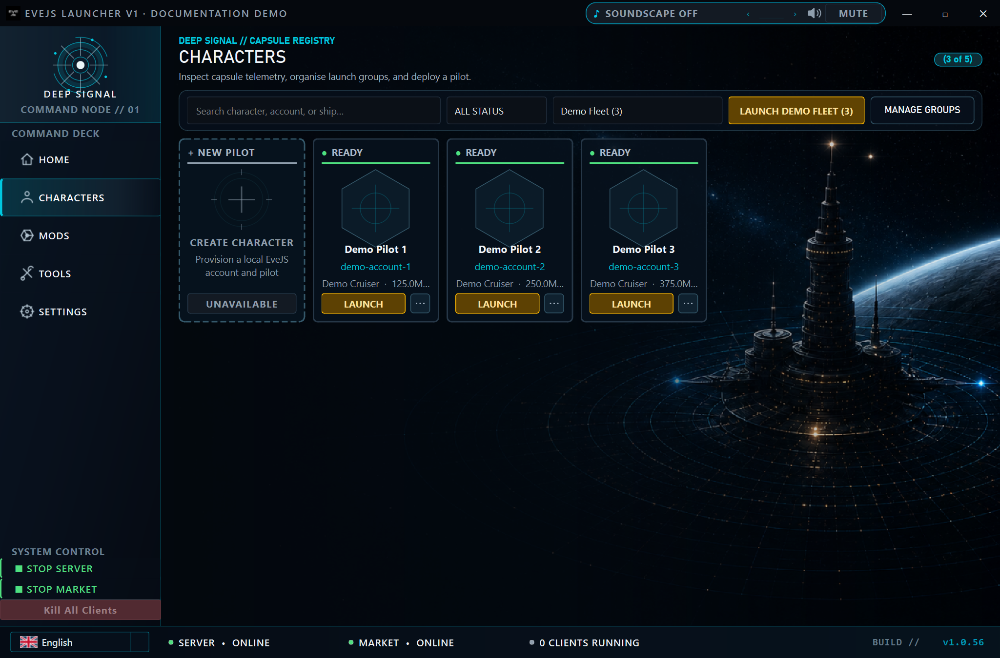

# 🚀 EveJS Launcher V1

<p align="center">
  
</p>

<p align="center">
  <strong>A dark, cinematic desktop launcher for <a href="https://github.com/V0nCleef/evejs-launcher">EveJS</a> —<br>manage multiple EVE Online accounts, start servers, toggle mods, and launch clients, all from one window.</strong>
</p>

<p align="center">
  
  
  
  
</p>

---

## What is this?

The **EveJS Launcher V1** is a native Windows desktop app (PyQt6) that replaces the command-line workflow of [EveJS](https://github.com/V0nCleef/evejs-launcher) with a polished graphical interface. It handles everything you'd normally do across multiple terminal windows:

- **Start & stop** the Game Server, Market Server, and Proxy (ports 26000/26001/26002)
- **Manage multiple EVE accounts** with character portraits, stats (ISK, SP, ship, sec status), and zero-copy Junction profiles
- **Launch EVE clients** in parallel with configurable stagger delays — then kill them all with one click
- **Toggle mods** on/off without manually renaming `loader.js` files
- **Auto-update** itself silently from GitHub Releases

The UI is a dark, EVE Online-inspired theme with teal accents, animated hero banners, cross-fade transitions, and a scanline overlay.

---

## ✨ Features

### 🖥️ Server Management
- One-click **Start All Servers** (Market → Game, with dependency wait)
- One-click **Stop Server** with graceful shutdown
- Live status dots in the status bar (click to open the console panel)
- Process tracking — see exactly what's running

### 👤 Character Management
- **Grid layout** (3 per row) with animated cards
- **Junction-based profiles** — zero disk copy, pure symlink/hardlink
- Character detail panel: portrait, ISK, ship, SP, location, security status
- **Hide / unhide** characters without deleting config
- Selection glow + lift animation on click
- Async portrait loading with hex-masked rendering

### 🚀 Client Launcher
- **Launch All** — fires up every visible account with a stagger delay
- **Kill All Clients** — terminates all running EVE clients instantly
- **Auto-login** support — skip the character select screen
- **Group-based launching** — group characters by fleet or role

### 🧩 Mod Manager
- Auto-discovers mods from your EveJS `mods/` folder
- **Toggle switches** enable/disable mods with a click (renames `loader.js`)
- Server restart indicator reminds you changes take effect on next boot

### 🪟 UI & UX
- **Frameless window** with custom title bar (minimize, maximize, close)
- **Animated hero banner** — cross-fading fleet/station/nebula art with Ken Burns zoom
- **Page transitions** — smooth fade between Home, Characters, Mods, Settings
- **Card hover effects** — teal glow + lift
- **EVE-style scanline overlay** on the home page
- Animation toggle in Settings for a classic static look
- **Discord invite card** — dark-themed, links to the EveJS community

### 🔄 Auto-Update
- Checks GitHub Releases for new versions on launch
- One-click **"Update Available"** gold button in the status bar
- Silent VBScript updater — waits for exit, swaps the `.exe`, relaunches
- No UAC prompts, no installer, no manual downloads

### 🧙 First-Run Wizard
- Automatically appears when no `evejs_root` is configured
- Walks you through: Welcome → Browse EveJS folder → Validation → Done
- Saves config and launches the full app

---

## 📸 Screenshots

### Home


### Characters


---

## 📦 Installation

### Download (recommended)

Grab the latest `EveJS-Launcher-V2.exe` from the [Releases](https://github.com/V0nCleef/evejs-launcher/releases) page.

1. Download the `.exe`
2. Place it anywhere (Desktop, EveJS folder, etc.)
3. Run it — the first-run wizard will ask for your EveJS root folder

**That's it.** No Python, no dependencies, no install. The auto-updater keeps it current.

---

## 🔨 Building from Source

### Prerequisites
- Python 3.11+
- Git
- Windows 10 or newer

```bash
# Clone the repo
git clone https://github.com/V0nCleef/evejs-launcher.git
cd evejs-launcher

# Install dependencies
pip install -r requirements.txt

# Run directly
python main.py
```

### Build the standalone `.exe`

```bash
build.bat
```

The optimized executable lands at `dist/EveJS-Launcher-V2.exe` (~28 MB, UPX disabled for stability).

---

## ⚙️ Configuration

On first launch the setup wizard guides you through:

| Setting | Description |
|---|---|
| **EveJS Root** | Path to your EveJS installation (contains `game-server/`, `market-server/`, `mods/`) |
| **EVE Client Path** | Path to `ExeFile.exe` (e.g. `C:\EVE\SharedCache\tq\bin\exefile.exe`) |
| **Stagger Delay** | Seconds between launching each EVE client (default: 3) |
| **Animations** | Enable/disable animated hero banner, page transitions, and card effects |
| **Hero Rotation** | Interval in seconds between hero banner cross-fades (3–30s) |

Config is stored at `%APPDATA%/EveJS-Launcher-V2/config.json`.

---

## 🧱 Project Structure

```
evejs-launcher/
├── main.py                  # Entry point — boots QApplication + MainWindow
├── build.spec               # PyInstaller spec (aggressive pruning for small .exe)
├── build.bat                # One-click build script
├── requirements.txt         # PyQt6, pyautogui, pygetwindow, pyinstaller
├── CHANGELOG.md             # Release notes per version
├── VERSION                  # Current version (semver)
├── update_helper.py         # Python updater (fallback)
├── update_helper.vbs        # Silent VBScript updater (primary)
│
├── assets/
│   ├── hero/                # Animated banner images (fleet, station, nebula)
│   ├── logo.ico             # App icon
│   └── *.png                # Discord logo, etc.
│
└── src/
    ├── app.py               # MainWindow — frameless window, navigation, resize
    ├── config.py            # JSON config load/save
    ├── constants.py         # Colors, ports (26000/26001/26002), enums
    ├── theme.py             # QSS stylesheet builder + font loader
    ├── wizard.py            # First-run setup wizard dialog
    │
    ├── core/
    │   ├── launcher.py      # EVE client process management
    │   ├── server_launcher.py  # Game + Market server lifecycle
    │   ├── process_tracker.py  # Live process monitoring
    │   ├── profiles.py      # Junction-based profile creation
    │   ├── mod_manager.py   # Mod discovery + loader.js toggle
    │   ├── autologin.py     # Auto-login to character select
    │   ├── discovery.py     # Account scanning
    │   ├── db.py            # SQLite character database
    │   └── groups.py        # Character grouping
    │
    ├── pages/
    │   ├── home_page.py     # Stats, buttons, changelog, Discord card
    │   ├── characters_page.py  # Grid, cards, detail panel
    │   ├── mods_page.py     # Mod list with toggle switches
    │   └── settings_page.py # All configuration options
    │
    ├── widgets/
    │   ├── character_card.py   # Animated selection card
    │   ├── detail_panel.py     # ISK, SP, ship, location, sec status
    │   ├── hero_banner.py      # Cross-fading animated banner
    │   ├── console_panel.py    # Server output viewer
    │   ├── toggle_switch.py    # Custom toggle widget
    │   ├── update_button.py    # Gold update-available button
    │   ├── status_bar.py       # Clickable status indicators
    │   ├── title_bar.py        # Frameless window chrome
    │   ├── nav_panel.py        # Sidebar navigation
    │   └── skeleton_card.py    # Loading placeholder
    │
    ├── workers/
    │   ├── db_worker.py        # Threaded database ops
    │   ├── portrait_worker.py  # Async portrait loading
    │   └── server_worker.py    # Server status polling
    │
    └── updater/
        ├── github.py       # GitHub Releases API client (stdlib only)
        ├── checker.py      # Version comparison + update notification
        ├── dialog.py       # "Update available" modal
        └── installer.py    # Download + spawn VBS updater
```

---

## 🔄 Auto-Update Flow

```
Launch → Check GitHub API → New version found?
  ├─ No  → Continue normally
  └─ Yes → Show gold "Update Available" button
            → Click → Download .exe to %TEMP%
            → Spawn update_helper.vbs (silent, no console)
            → Launcher closes
            → VBS waits 5s, replaces old .exe, launches new one via explorer.exe
            → Done — zero clicks after the initial button press
```

The VBScript approach avoids all the pitfalls of Python-based update helpers — no inherited process handles, no stale DLL state, no UAC prompts.

---

## 🤝 Contributing

1. Fork the repo
2. Create a feature branch (`git checkout -b feature/cool-thing`)
3. Make your changes
4. Run `python main.py` to test locally
5. Submit a PR

Please keep the dark EVE aesthetic and test on Windows 10+.

---

## 📝 License

MIT — see [LICENSE](LICENSE).

---

## 🔗 Links

- [EveJS Launcher Releases](https://github.com/V0nCleef/evejs-launcher/releases)
- [EveJS Discord](https://discord.gg/HVTfKeqX3t)
- [EveJS (the server)](https://github.com/V0nCleef/evejs-launcher)
