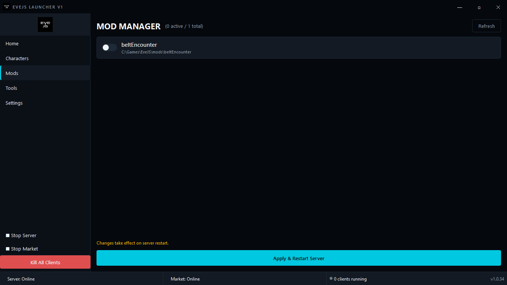
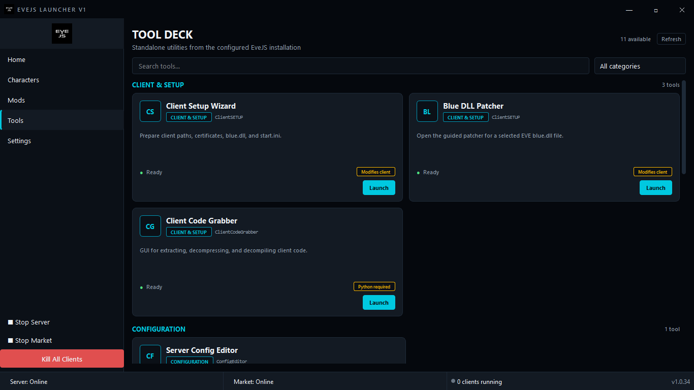
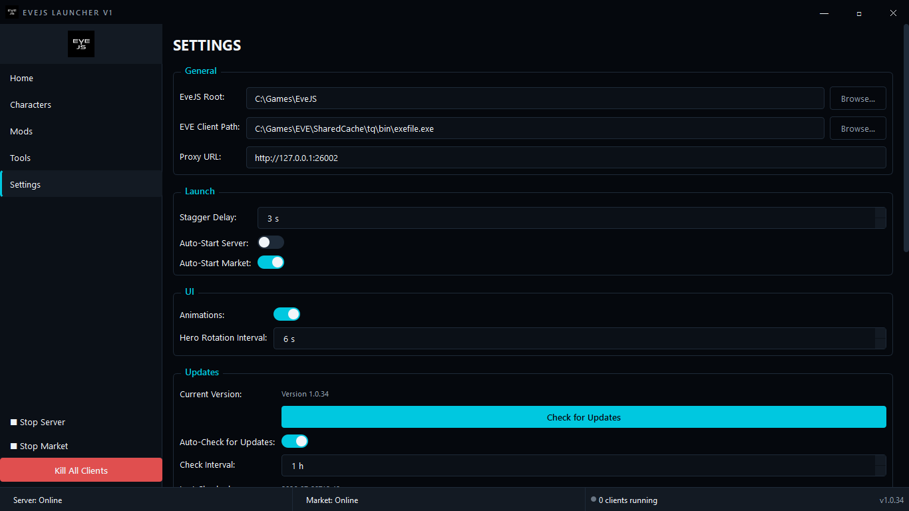

# EveJS Launcher

EveJS Launcher is a Windows desktop control panel for a local EveJS installation. It brings the game server, market server, EVE clients, character profiles, mods, maintenance tools, and launcher updates into one application.

[Download the latest release](https://github.com/V0nCleef/evejs-launcher/releases/latest) · [Read the release notes](https://github.com/V0nCleef/evejs-launcher/releases) · [Join the EveJS Discord](https://discord.gg/HVTfKeqX3t)


The Home page is the operational view: current service state, account and character totals, running clients, stack controls, release notes, and direct access to both service consoles.

## Start here

### What you need

- Windows 10 or Windows 11
- An existing EveJS installation
- An EVE client prepared for use with EveJS

### Install the launcher

1. Open the [latest release](https://github.com/V0nCleef/evejs-launcher/releases/latest).
2. Download `EveJS-Launcher-V1.zip`.
3. Extract the complete `EveJS-Launcher-V1` folder.
4. Run `EveJS-Launcher-V1.exe` from inside that folder.
5. On first launch, select the root folder of your EveJS installation.

Keep the `_internal` folder beside the executable. The release is a portable application folder, not a single standalone executable. Python is not required when using a release build.

### First launch

The setup wizard validates the EveJS root, attempts to locate the EVE client, saves the configuration, and then loads the character list. After setup:

1. Use **Start Stack** on Home to start Market followed by Game.
2. Wait for both services to report **Online**.
3. Open **Characters** and launch the account you want to use.
4. Enter the password in the EVE client. The launcher does not store or type passwords.

## Interface tour

The launcher has five navigation pages. The screenshots below were captured from v1.0.34. Character and account names are intentionally blurred, and local paths use generic examples.

### Home

Home combines service controls and status in one place. Game and Market are tracked independently through Offline, Starting, Online, Stopping, and Failed states. A service started outside the launcher is detected as externally managed and is never force-stopped by the launcher.

The screenshot at the top of this page uses a simulated healthy runtime state; no server processes were started to create it.

### Characters


Characters are read from the configured EveJS installation and grouped into account-aware cards. Each card shows the portrait, wallet balance, ship, launch state, and account state. Selecting a card opens the detail panel with skill points, location, security status, and launch controls.

The launcher prevents two characters on the same account from being launched at the same time. Hidden and development accounts can be removed from the normal grid without deleting their game data.

### Mods



The Mod Manager scans the configured `mods` folder and shows the active state of each discovered mod. Changes take effect after the game server restarts. **Apply & Restart Server** routes through the same server-mode selection used by every other start path.

### Tools



Tool Deck exposes a reviewed set of utilities from the configured EveJS `tools` folder. It supports text search, category filtering, prerequisite labels, wrapper availability, and responsive one- or two-column layouts.

The launcher does not recursively expose arbitrary scripts. It resolves only known top-level wrappers, opens them in independent visible consoles, and asks for confirmation before destructive or system-changing actions.

### Settings



Settings covers the EveJS root, EVE client path, proxy address, launch timing, service auto-start, animation preferences, update checks, server-mode selection, hidden characters, and local-data cleanup.

## What the launcher manages

| Area | Behaviour |
|---|---|
| Game service | Starts Node.js directly in vanilla or modded mode and reports lifecycle state. |
| Market service | Starts the market service before Game when the complete stack is requested. |
| EVE clients | Creates account-specific profiles, launches clients through the local proxy, and tracks running state. |
| Bulk launch | Launches eligible accounts serially with a configurable delay; remaining queued launches can be cancelled. |
| Characters | Reads account and character data, loads generated portraits asynchronously, and supports search and hiding. |
| Mods | Discovers mods, toggles their loader state, and restarts Game when requested. |
| Tools | Resolves 11 reviewed external utility wrappers with prerequisite and risk information. |
| Updates | Checks GitHub Releases, downloads the release ZIP, shows progress, stages replacement, restarts, and cleans validated update artifacts. |

## Service startup and detection

EveJS installations may include more than one `StartServer*.bat` file. The launcher uses those filenames as mode indicators:

- `StartServer.bat` means vanilla mode.
- `StartServerWithMods.bat` means modded mode.
- With more than one supported indicator, Settings can save a default or keep **Always ask**.
- With one supported indicator, that mode is selected automatically.

The batch files are not executed. They may contain interactive prompts that do not behave correctly inside a GUI launcher. Game is always started through Node.js directly with an explicit mode.

When **Start Stack** is used, Market is started first and Game waits for the required readiness state. Controls remain responsive while startup and shutdown checks run in background workers.

If an already-running Game or Market endpoint is detected, it is shown as externally managed. The launcher can use that service but will not claim ownership or terminate it.

<details>
<summary>Service ports and readiness checks</summary>

| Port | Purpose |
|---:|---|
| `26000` | Game TCP endpoint used by EVE clients |
| `26001` | Game server's internal market proxy |
| `26002` | Local HTTP proxy used by launched clients |
| `40110` | Market HTTP administration endpoint |
| `40111` | Market RPC endpoint used for Market readiness detection |

Market readiness is checked against port `40111`, not `26001`. Port `26001` can be reachable while only the game server is running, so treating it as the Market service would produce a false Online state.

</details>

## Client profiles and launching

Each account receives an isolated launcher profile under:

```text
%APPDATA%\EveJS-Launcher\Profiles\<account>\tq
```

On Windows these profiles use directory junctions rather than copying the complete EVE client. The launcher prepares the minimum settings required by the client, pre-fills the account username, points traffic at the configured local proxy, and launches the selected EVE executable.

Passwords are not stored by the launcher. Password entry remains inside the EVE client.

**Launch All** uses a serial queue instead of opening every client at once. The configured stagger delay is applied between accounts, the application stays responsive, and cancelling the queue stops only future launches. Clients that already started remain open.

## Mod handling

A mod is discovered from the configured EveJS `mods` directory. Its active state is derived from its loader file. Toggling a row changes that loader state on disk; it does not hot-reload the running game server.

Use **Apply & Restart Server** when the new mod state should take effect. The restart uses the same saved or prompted vanilla/modded selection as Home, client-triggered auto-start, and the navigation controls.

## Tool Deck catalogue

Tool Deck currently recognises 11 reviewed wrappers. Availability is resolved from the selected EveJS installation; the tools are not bundled into the launcher.

<details>
<summary>View the complete tool catalogue</summary>

| Category | Tool | Notes shown by the launcher |
|---|---|---|
| Client & Setup | Client Setup Wizard | Prepares client paths, certificates, `blue.dll`, and `start.ini`. |
| Client & Setup | Blue DLL Patcher | Opens the guided patcher for a selected client DLL. |
| Client & Setup | Client Code Grabber | Requires Python; extracts and processes client code. |
| Configuration | Server Config Editor | Docker Desktop is required for containerized installations. |
| Data & Content | Local Database Creator | Downloads SDE data and generates local database content. |
| Data & Content | Reset Local Databases | Includes a non-destructive preview and confirmation before reset. |
| Data & Content | New Eden Store Editor | Requires Python; edits store catalogue and configuration data. |
| Market | Market Seed Builder | Opens an interactive build, smoke-check, and diagnostics menu. |
| Market | Market Seed Builder GUI | Opens graphical market-seed build and diagnostics controls. |
| Market | TQ Market Snapshot Seeder v2 | Builds and inspects public market snapshot seed data. |
| Market | Rust & MSVC Market Setup | May request Administrator permission and change the system toolchain. |

Every launch request is re-resolved against the current EveJS root before a process is created. Destructive and system-level actions are confirmed at the final launch boundary rather than relying only on the visible card state.

</details>

## Updates

The launcher checks the latest GitHub Release on startup when automatic checks are enabled. Manual checks are available in Settings.

For an update, the launcher:

1. Downloads the release ZIP with visible byte progress.
2. Extracts and validates the new application folder in a staging location.
3. Keeps the update window open while the old launcher exits.
4. Renames the current installation to a rollback copy ending in `.old`.
5. Copies and verifies the new onedir installation.
6. Restarts the new executable.
7. Removes only the validated staging and rollback artifacts after successful restart.

The updater works with the complete application folder. Moving only the executable or deleting `_internal` breaks both normal startup and updates.

## Configuration reference

Configuration is stored in:

```text
%APPDATA%\EveJS-Launcher\config.json
```

| Setting | Purpose | Default |
|---|---|---|
| EveJS Root | Installation containing the server, mods, tools, and game data | Not set |
| EVE Client Path | `exefile.exe` used for launched clients | Detected during setup when possible |
| Proxy URL | Local client-traffic proxy | `http://127.0.0.1:26002` |
| Stagger Delay | Delay between queued client launches | `3 seconds` |
| Auto-Start Server | Starts Game when a client requires it | Off |
| Auto-Start Market | Starts Market when required | Off |
| Server Start Selection | Always ask or a detected vanilla/modded indicator | Always ask |
| Animations | Hero rotation and page effects | On |
| Hero Rotation Interval | Time between Home banner images | `6 seconds` |
| Auto-Check for Updates | Periodic GitHub Release checks | On |
| Update Check Interval | Time between automatic checks | `6 hours` |
| Hidden Characters | Characters omitted from the normal grid | Empty |

Settings are written atomically. If the stored configuration is malformed, the launcher backs it up and recovers with defaults rather than continuing with a partially loaded file.

## Common questions

<details>
<summary>Why does a service say it is managed externally?</summary>

The endpoint is reachable, but the process was not started by this launcher instance. The launcher reports the service and can continue using it, but it will not terminate a process it does not own. Stop it from the console or application that originally started it.

</details>

<details>
<summary>Why did a mod change not take effect?</summary>

Mod toggles change files on disk. Restart the game server after changing them. **Apply & Restart Server** performs that restart through the normal server-mode resolver.

</details>

<details>
<summary>Why is a tool marked unavailable?</summary>

Tool Deck checks the configured EveJS root and the known wrapper path under its `tools` folder. Use Refresh after changing the root or adding a tool. An inaccessible wrapper disables only that card; it does not break the rest of the page.

</details>

<details>
<summary>Why is a character portrait missing?</summary>

Portraits are generated by the EveJS server and are not stored in the main game database. After moving or upgrading an EveJS installation, copy the generated Character image directory as well or let the server regenerate the portraits.

</details>

<details>
<summary>Can I move the executable out of the extracted folder?</summary>

No. The current release uses PyInstaller onedir packaging. Run the executable with its `_internal` directory beside it.

</details>

## Running from source

Python 3.11 or newer is recommended.

```text
git clone https://github.com/V0nCleef/evejs-launcher.git
cd evejs-launcher
python -m venv .venv
.venv\Scripts\activate
python -m pip install -r requirements.txt -r requirements-dev.txt
python main.py
```

Run the automated checks with:

```text
python -m pytest
```

<details>
<summary>Project layout</summary>

```text
main.py                     Application entry point
src/app.py                  Main window and application wiring
src/config.py               Atomic JSON configuration storage
src/core/                    Service, client, profile, database, mod, and tool logic
src/pages/home_page.py       Runtime dashboard
src/pages/characters_page.py Character grid and detail panel
src/pages/mods_page.py       Mod discovery and toggles
src/pages/tools_page.py      Curated external Tool Deck
src/pages/settings_page.py   Configuration and maintenance controls
src/widgets/                 Shared PyQt6 controls and panels
src/workers/                 Background database, portrait, and service work
src/updater/                 Release checks, progress UI, and staged replacement
tests/                       Automated regression and layout coverage
```

The application is built with PyQt6 and packaged for Windows with PyInstaller in onedir mode.

</details>

## Project status

The launcher is Windows-only. Releases are published as portable ZIP archives on the [Releases page](https://github.com/V0nCleef/evejs-launcher/releases).

Bug reports and focused pull requests are welcome. When reporting a service problem, include the launcher version, which service failed, whether it was started inside or outside the launcher, and the relevant console output. Do not include account names, character names, passwords, or tokens in public reports.

EVE Online and EVE are registered trademarks of CCP hf. This project is not affiliated with CCP Games.
