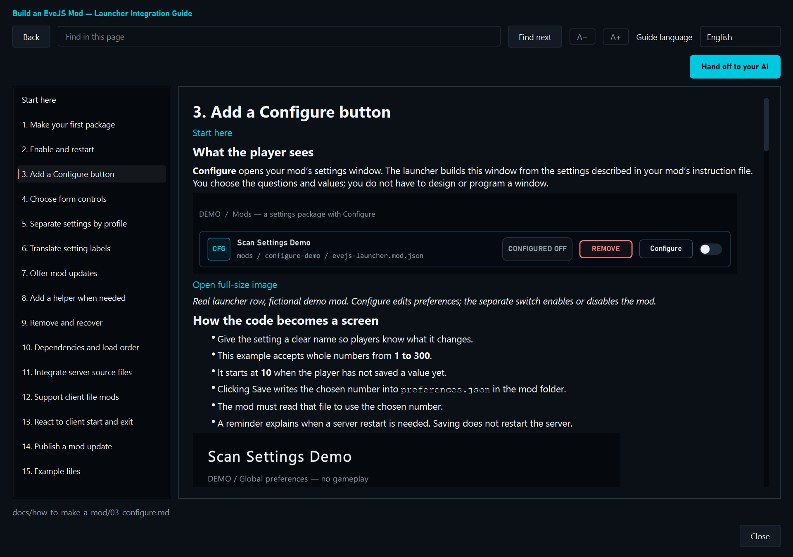

# EveJS Launcher

A Windows launcher for your local EveJS server and EVE clients. Start Game and Market, launch characters and groups, manage mods, and open maintenance tools from one place. Choose Native or Docker Compose to match your EveJS installation.

[Download the latest release](https://github.com/V0nCleef/evejs-launcher/releases/latest) · [Release notes](https://github.com/V0nCleef/evejs-launcher/releases) · [How to make a mod](docs/how-to-make-a-mod/) · [EveJS Discord](https://discord.gg/HVTfKeqX3t)


*Screenshots show the v1.0.56 interface with fictional demo characters and mods. Online service states and the offered mod update are examples; no game services were started for these captures. Click an image to see it at full size.*

## What's new in 1.0.60

- Fixed stale ISK by reading the current personal wallet balance.
- The whole character page now refreshes after client starts/exits and Game or Market state changes. Existing cards and the selected details update in place.
- Personal security shows two decimals. Solar-system security appears beside the location.
- Added official ship and system names for the selected language where available, including Chinese, Japanese and Korean. Custom names stay unchanged.
- Translated the balance and skill-point headings and security/location tooltips. Language changes keep the selected character and displayed data intact.

## Install and start

You need Windows 10 or 11, an existing EveJS installation, and an EVE client prepared for EveJS. The launcher does not include the game client or server.

1. Download **EveJS-Launcher-V1.zip** from the [latest release](https://github.com/V0nCleef/evejs-launcher/releases/latest).
2. Extract the **complete folder**, then run `EveJS-Launcher-V1.exe`. Keep `_internal` beside it. You do not need Python for a release build.
3. Follow the setup wizard. Select your EveJS root and EVE client folder, then choose the runtime that your installation uses.
4. For Docker, run **Test Docker setup** before continuing.
5. On Home, choose **Start Stack**. Market starts first, followed by Game.
6. When both are Online, open **Characters** and launch a character or group.

| Runtime | What it needs | What the launcher does |
| --- | --- | --- |
| **Native** | Node.js and npm; a built Market Server binary or the Rust/Cargo tools to build it | Runs Game and Market directly on Windows. Docker Desktop is not required. |
| **Docker Compose — Managed** | Docker Desktop in Linux-container mode, Compose v2, and an existing EveJS Compose project | Starts, stops, and maintains the selected stack. |
| **Docker Compose — Connect only** | An existing Docker stack controlled elsewhere | Shows status and logs without changing containers. |

Changing runtime does **not** move characters, market data, or server data. The launcher never silently switches runtimes.

## Home: services and group launches

Home shows separate Game, Market, and client states, recent activity, stack controls, and your selected character group. Open service consoles from the status controls to inspect output.

For Native Game, the enabled loader mods determine the startup mode automatically: no enabled loaders means **Vanilla**; enabled loaders means **Modded**. There is no server-script selector and no separate modded `.bat` file to configure. Restart Game after changing server mods.

Services started elsewhere are detected as externally managed. The launcher does not claim them as its own or force-stop them.

## Characters: launch one pilot or a group


- Browse characters from the selected EveJS installation, with portraits, wallet and ship information. Select a card for more detail.
- Search, filter, hide characters, and create named launch groups with **Manage Groups**.
- Launch one character, all visible characters, or the selected group. Launches are staggered, and the same account cannot be launched twice at once.
- Cancel a launch queue without closing clients that already started.
- Create characters on Native or compatible Managed Docker installations. Optional GM and overview-copy controls are available where supported.
- On Native, deletion requires services and clients to be offline, makes a backup, and asks for typed confirmation.

Each account uses its own launcher profile. Normal login stays inside the EVE client. Compatible Native installations can opt into **Auto-Login Character** after the launcher verifies the supported client and local server setup; real account passwords are not stored.

## Mods: install, configure, update, and recover


Use **Add ZIP** or **Add Folder** to import a compatible package, or **Open Mod Folder** to inspect the selected installation's mods. The buttons a mod offers depend on what its author supports.

| Control | What it does |
| --- | --- |
| **Enable switch** | Changes whether the mod is configured to run. Server mods need a Game restart. |
| **Configure** | Opens the settings form supplied by the mod. It may include switches, number fields, lists, translated labels, and settings for individual profiles. |
| **Check mod updates** | Looks for compatible releases. Checking does not install anything. |
| **Gold Update button** | Opens the offered version and release notes for review before installation. A gold badge on Mods shows available updates. |
| **Actions** | Shows supported package actions, such as client preparation or removal. |
| **Remove / Undo Removal** | Removes supported local packages and restores them from launcher recovery storage where available. |
| **Apply & Restart Server** | Applies configured server-mod changes through the normal restart flow and checks the resulting state. |

The launcher supports loader packages, declared source integrations, settings-only packages, and compatible client-file integrations. It also supports declared dependencies, load order, helper programs, and client start/exit events. It does not guess how an arbitrary source patch should be enabled or removed.

Compatible mod updates preserve declared settings files. Other mutable files must be declared by the mod author. Source integrations and client-file packages can have their own removal and recovery rules; follow the actions offered by that package.

## How to make a mod



Open **Mods → Make a mod**, or read [How to make a mod on GitHub](docs/how-to-make-a-mod/).

The guide starts with a small package, then covers Configure forms, controls, profiles, translations, updates, helpers, removal, dependencies, server integration, client files, client events, and publishing. Pick only the features your mod needs.

Every topic includes screenshots that show what the instructions mean in the launcher. Code examples are at the bottom, below a clear divider. The launcher version also lets you:

- Choose English, Simplified Chinese, Japanese, Korean, French, German, Dutch, or Russian for explanations. Code and filenames stay literal.
- Search the current page, enlarge text, resize or maximize the window, and open screenshots at full size.
- Download the bundled example files as a ZIP.
- Copy the current feature's prompt using **Hand off to your AI**, then paste it into the tool you use.

The guide explains launcher support. Your mod still supplies its own gameplay or graphics behaviour.

## Tools: utilities from your EveJS installation


Tool Deck finds supported utilities in the selected EveJS `tools` folder. Search by name or filter by category. Each card shows its requirements, availability, and actions. Destructive or system-changing operations ask for confirmation.

Available tools depend on your EveJS installation and runtime. They are not bundled into the launcher.

<details>
<summary>Supported tool categories and examples</summary>

| Category | Tools |
| --- | --- |
| Client & Setup | Client Setup Wizard, Blue DLL Patcher, Client Code Grabber |
| Configuration | Server Config Editor |
| Data & Content | Local Database Creator, Reset Local Databases, New Eden Store Editor |
| Market | Market Seed Builder, Market Seed Builder GUI, TQ Market Snapshot Seeder v2, Rust & MSVC Market Setup |

Native actions use known wrapper files. Managed Docker offers supported Compose actions when the project provides the required services. Connect-only mode keeps container-changing actions unavailable.

</details>

## Settings: paths, runtime, audio, and readability


Settings contains the EveJS and client paths, proxy address, runtime selection, launch delay, service auto-start, compatible auto-login, hidden characters, update checks, and local-data maintenance. Unsaved changes are tracked before you leave the page.

The language selector changes the launcher interface between eight languages. **Reduce motion** pauses optional interface motion. Version 1.0.56 increases the small text throughout the interface; the guide also has its own **A− / A+** controls.

### Docker setup


Normally leave **Compose File** blank to use `<EveJS Root>\compose.yaml`. Leave the advanced **Compose Project Name** blank unless you need to match an existing custom project name. Choose **Managed** or **Connect only**, then use **Test Docker setup**.

The setup test checks the selected project without starting containers or initializing data. Docker Desktop must use Linux containers, the project must provide the expected Game and Market services, and published EveJS endpoints must bind to loopback. An uninitialized project can pass setup checks while still needing its normal initialization steps.

### Audio and LYRA


Control music and voice independently, including their volume. The title bar provides music mute and previous/next controls. The launcher can play bundled music and supported local tracks.

**LYRA** is the bundled English (UK), prerecorded voice pack for launcher events. It is separate from EVE's Aura. Use **Preview LYRA** to hear it, choose whether results are announced, and set how much music plays while LYRA speaks. Announcements run locally.

## Launcher updates and saved settings

The launcher checks GitHub Releases when automatic checks are enabled. You can also check manually in Settings. The update window shows download and installation progress, then restarts the launcher.

The updater replaces the launcher executable and its `_internal` folder. Your launcher configuration lives separately in `%APPDATA%\EveJS-Launcher`; updating the launcher does not migrate or replace your EveJS game data.

<details>
<summary>Local files and defaults</summary>

| Item | Location or default |
| --- | --- |
| Launcher settings | `%APPDATA%\EveJS-Launcher\config.json` |
| Account profiles | `%APPDATA%\EveJS-Launcher\Profiles` |
| Launcher logs | `%APPDATA%\EveJS-Launcher\logs` |
| Client proxy | `http://127.0.0.1:26002` |
| Delay between launches | 3 seconds |
| Auto-start Game / Market | Off |
| Auto-Login Character | Off |
| Music / voice volume | 50% / 100% |
| Automatic update interval | 6 hours |

Settings are saved atomically. If the configuration is malformed, the launcher backs it up before recovering with defaults.

</details>

## Common questions

**My mod is enabled, but nothing changed.** Restart Game for server-mod changes. Configure changes a mod's preferences; it does not enable the mod. Some packages apply changes when a client next starts instead. Follow the package's instructions.

**A tool is unavailable.** Check that it exists in the selected EveJS installation and that its prerequisites are met, then Refresh. Runtime and control-policy restrictions can also disable an action.

**A service is marked External.** It was started outside this launcher instance. Stop it through the process or console that owns it.

**A portrait is missing after moving EveJS.** Portraits are generated by EveJS and are separate from the game database. Transfer the generated Character images too, or let the server regenerate them.

**Can I move just the EXE?** No. Keep the extracted application folder together, including `_internal`.

## Optional DLSS5 package

[EveJS-DLSS5](https://github.com/V0nCleef/EveJS-DLSS5) is a separate optional project. It is not bundled with the launcher, and a launcher update does not install it. See that project's current package, supported client build, requirements, installation instructions, and component licences.

Compatible packages can expose their setup and removal actions on Mods. Follow the package instructions and keep its saved installation receipts and backups. Do not stack separate installations on the same physical client.

## Running from source

Python 3.11 or newer is recommended.

```text
git clone https://github.com/V0nCleef/evejs-launcher.git
cd evejs-launcher
python -m venv .venv
.venv\Scripts\activate
python -m pip install -r requirements.txt
python main.py
```

The application uses PyQt6. Build the complete Windows application folder with `python -m PyInstaller build.spec`; distribute the entire onedir output. Match a released binary to its release tag when inspecting or rebuilding its source.

Tests live in `tests`. Guide maintenance instructions are in [the guide reference folder](docs/how-to-make-a-mod/reference/MAINTAINING.md).

## Support and licence

Use [GitHub issues](https://github.com/V0nCleef/evejs-launcher/issues) or the [EveJS Discord](https://discord.gg/HVTfKeqX3t) for support. Include the launcher version, runtime, and the relevant error. Remove private account details, passwords, and tokens from public reports.

EveJS Launcher is free and open-source software licensed under the [GNU General Public License version 3](LICENSE). You may use, copy, modify, and redistribute it, including commercially, under the GPLv3 terms. Distributed modified versions must keep the same freedoms and provide their corresponding source.

Packaged dependency licences and source links are listed in [THIRD_PARTY_NOTICES.md](THIRD_PARTY_NOTICES.md). Each release provides its matching source through its tag and GitHub source archives.

EVE Online and EVE are registered trademarks of CCP hf. This project is not affiliated with CCP Games.
