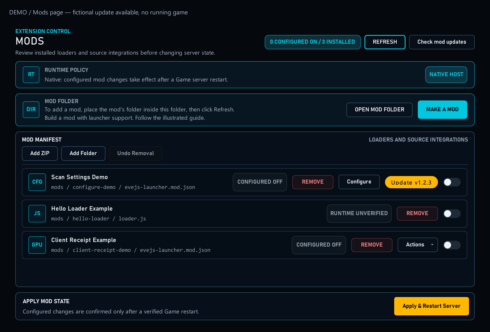

# Build an EveJS Mod — Launcher Integration Guide

Add launcher support to your mod, one feature at a time. You do not need every feature. Start with a small package, then add only what your mod needs.

The examples use manifest schema **3**, settings schema **1** and helper API **1** (Launcher **1.0.53 or newer**). Your mod still provides the gameplay or graphics behaviour.

[Open full-size image](mod-authoring/images/mods-overview.png)

## Choose one task

1. [Make your first package](mod-authoring/first-mod.md) — give the mod a name and import it.

2. [Enable and restart](mod-authoring/activation.md) — control when the mod runs.

3. [Add a Configure button](mod-authoring/configure.md) — let players change a setting.

4. [Choose form controls](mod-authoring/controls.md) — numbers, switches and lists.

5. [Separate settings by profile](mod-authoring/profiles.md) — different preferences for different characters.

6. [Translate your setting labels](mod-authoring/languages.md) — display text in the player’s language.

7. [Offer mod updates](mod-authoring/mod-updates.md) — show a newer GitHub release.

8. [Add a helper when needed](mod-authoring/helper-intro.md) — run preparation code.

9. [Remove and recover](mod-authoring/removal.md) — understand ownership and restoration.

10. [Dependencies and load order](mod-authoring/dependencies.md)

11. [Integrate server source files](mod-authoring/source-integration.md)

12. [Support client file mods](mod-authoring/client-files.md)

13. [React to client start and exit](mod-authoring/client-events.md)

14. [Publish a mod update](mod-authoring/publish-update.md)

15. [Example files](mod-authoring/example-files.md)

## How to use this guide

Choose a feature from the list on the left. Each page shows what it does and how to check it. All screenshots use clearly labelled examples. Open an image to enlarge it. Code examples are at the bottom of each relevant page, below a dividing line.

[14. Publish a mod update](mod-authoring/publish-update.md) explains the release files. [15. Example files](mod-authoring/example-files.md) lets you save the working examples.
