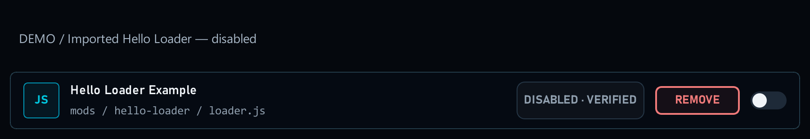
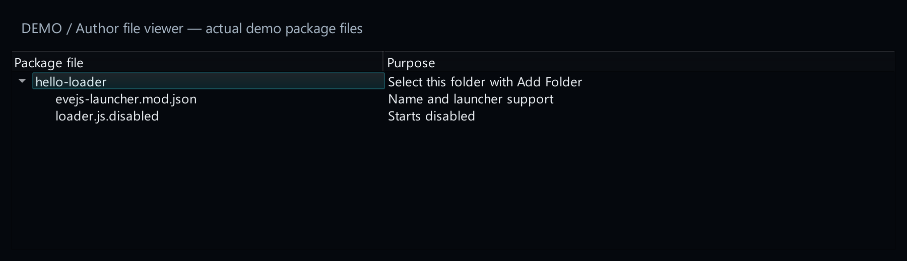
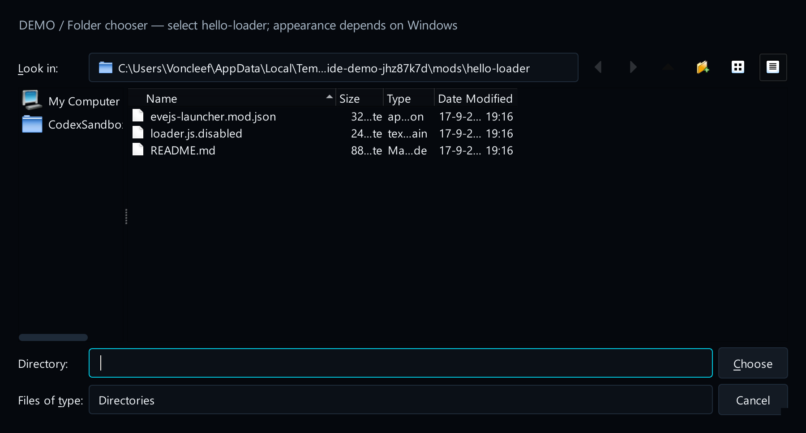
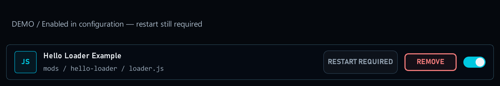

# 1. Make your first package

[Start here](00-start-here.md)

## What the player sees

A named row in **Mods**, with an on/off switch. This first example writes a message to the server console when loaded. It does not add gameplay.



[Open full-size image](images/loader-imported.png)

## What you add

Create these two files in a folder named `hello-loader`. Start with the loader disabled. The manifest is a small instruction file: it tells the launcher the mod’s name and which buttons it can offer. The loader is the mod code that EveJS runs when the mod is enabled.



[Open full-size image](images/package-files.png)

## Try it in the launcher


1. Open **Mods → Add Folder** and select `hello-loader`. You can also ZIP the folder and use **Add ZIP**.



[Open full-size image](images/import-folder.png)

2. After selecting the folder, check that the mod appears disabled in the list.


[Open full-size image](images/loader-imported.png)

3. Follow [Enable and restart](02-activation.md) to load it.



[Open full-size image](images/loader-enabled.png)

Keep permanent mod identifier stable when you release a new version. name shown to players is the name players see. A folder copied manually may need **Adopt** before the launcher can manage it.


[Open full-size image](images/loader-imported.png)

[15. Example files](15-example-files.md)


[Open full-size image](images/package-files.png)

---

## Code examples

```text
hello-loader/
  evejs-launcher.mod.json
  loader.js.disabled
```

```json
{
  "schemaVersion": 3,
  "id": "hello-loader",
  "displayName": "Hello Loader",
  "version": "1.0.0",
  "kind": "loader",
  "supportedBackends": [
    "native",
    "docker"
  ],
  "activation": {
    "strategy": "loader_rename"
  },
  "restart": "game_server"
}
```

```javascript
// loader.js.disabled
"use strict";
console.log("[Hello Loader] Loaded by EveJS Launcher.");
```
