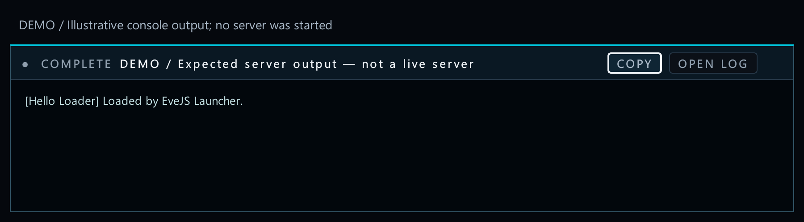
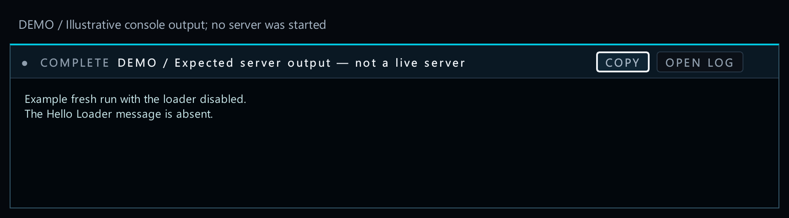
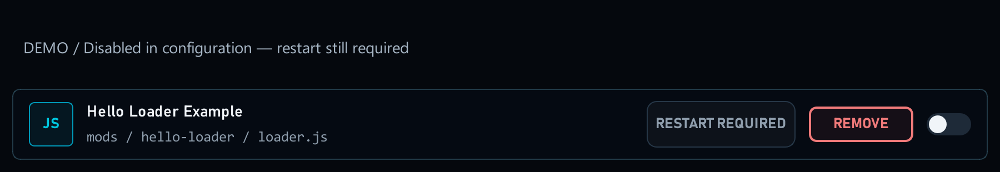

# 2. Enable and restart

[Start here](00-start-here.md)

## What the player sees

The switch changes the mod’s saved on/off state. **CONFIGURED ON** means the next applicable start should use the mod. It does not prove the running server has loaded it.


[Open full-size image](images/loader-enabled.png)

## Try the loader example


1. Turn on **Hello Loader**.


[Open full-size image](images/loader-enabled.png)

2. Use **Apply & Restart Server** when a restart is offered, or start the stopped Game server normally.


[Open full-size image](images/apply-restart.png)

3. Look for `[Hello Loader] Loaded by EveJS Launcher.` in the server console.



[Open full-size image](images/console-loaded.png)

4. Turn it off and restart again. That message should not appear in the new run.



[Open full-size image](images/console-disabled.png)

Normal Native startup includes enabled loaders. Explicit **Vanilla** startup omits them.



[Open full-size image](images/loader-disabled.png)

---

## Code examples

## What you declare

For this loader, the manifest uses the following fields. Other mod kinds have different activation contracts; see the [1. Make your first package](01-first-mod.md).

```json
"activation": {"strategy": "loader_rename"},
"restart": "game_server"
```
