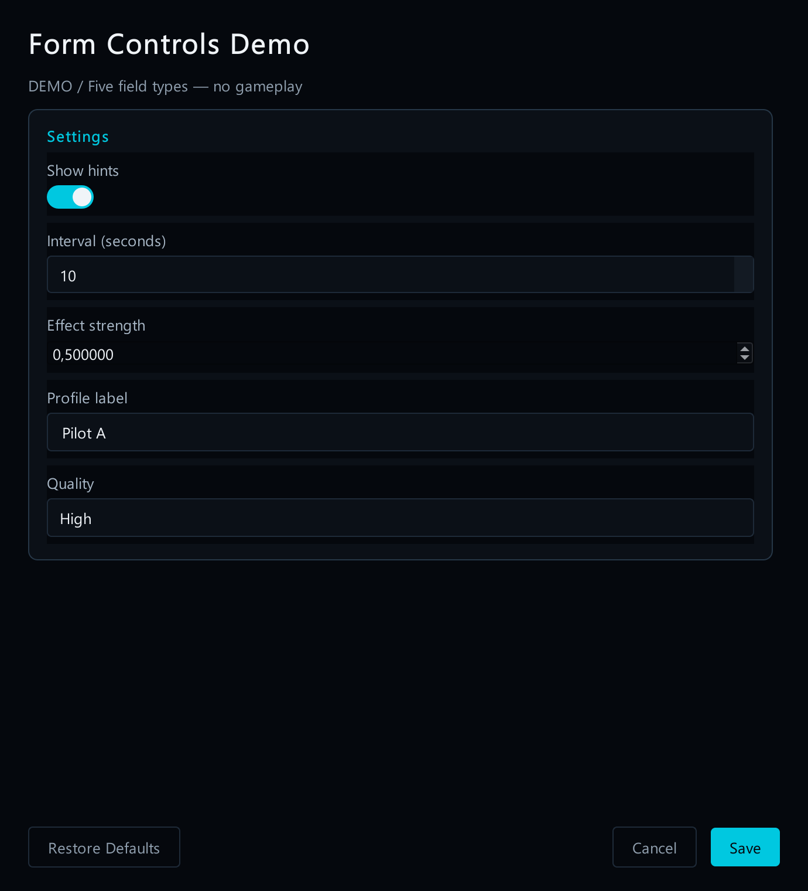
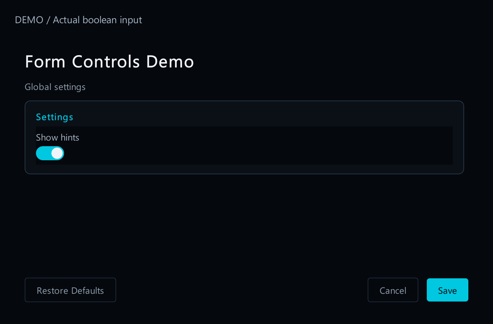
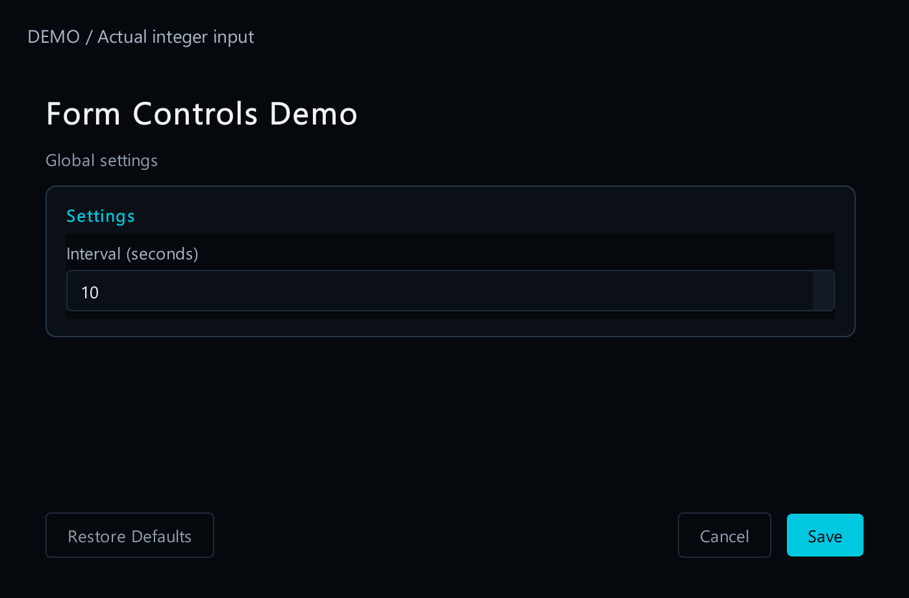
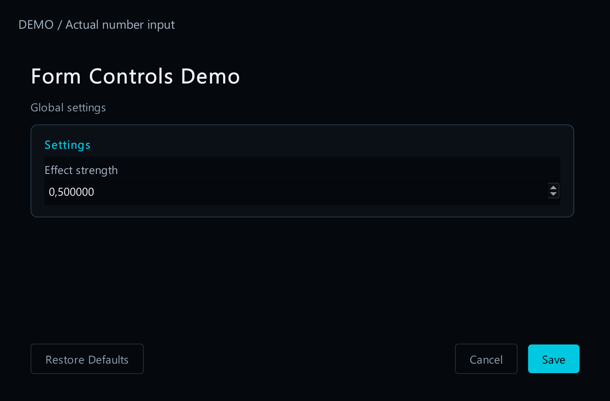
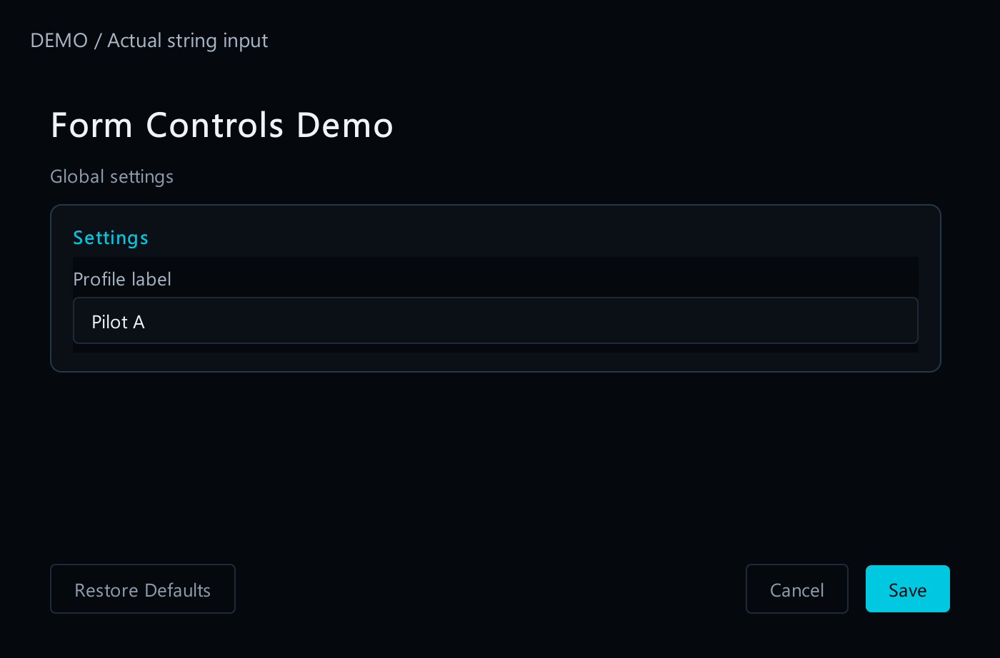
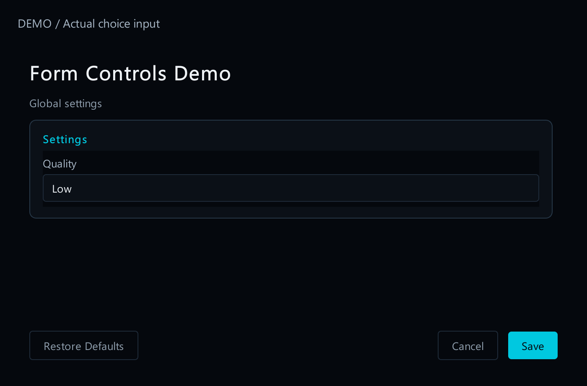
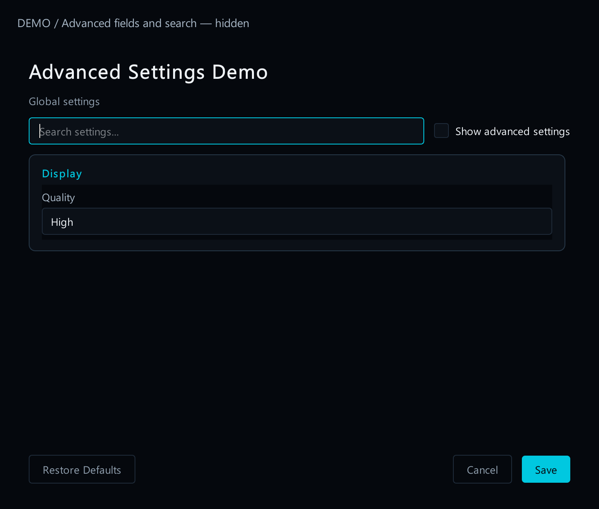
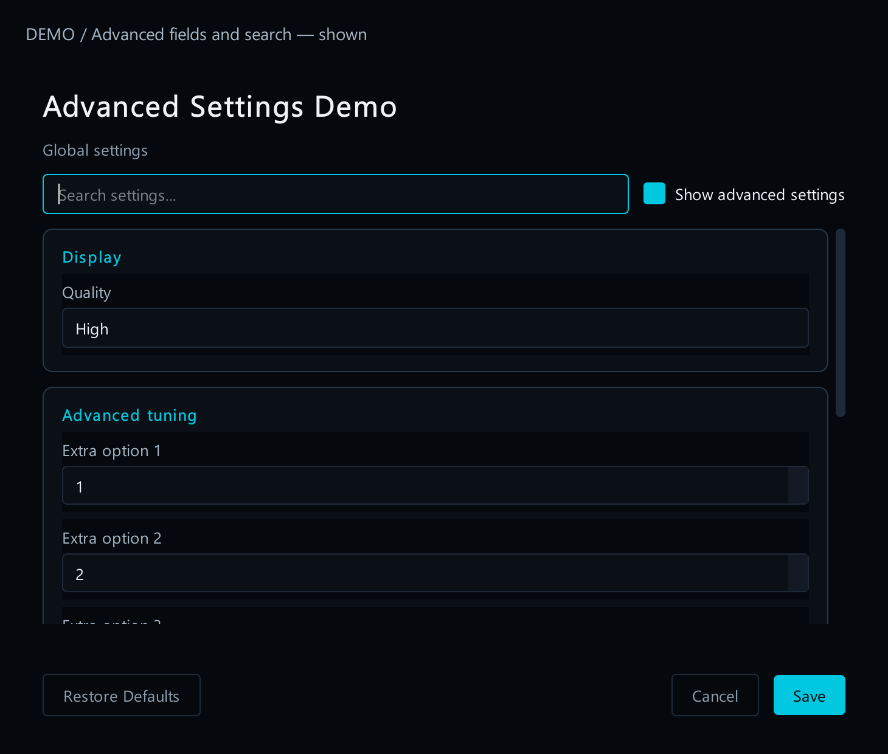
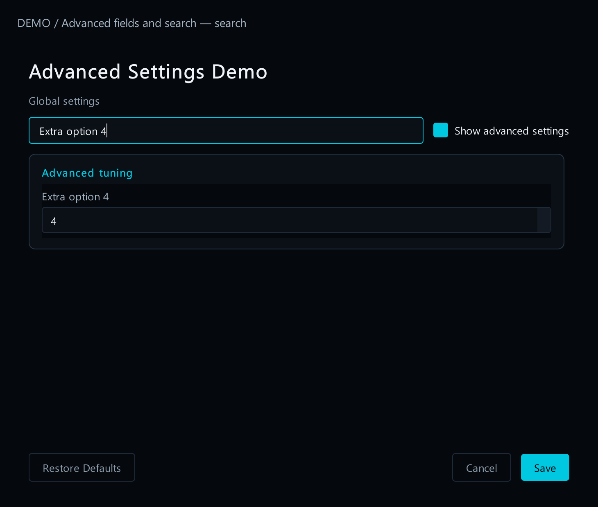
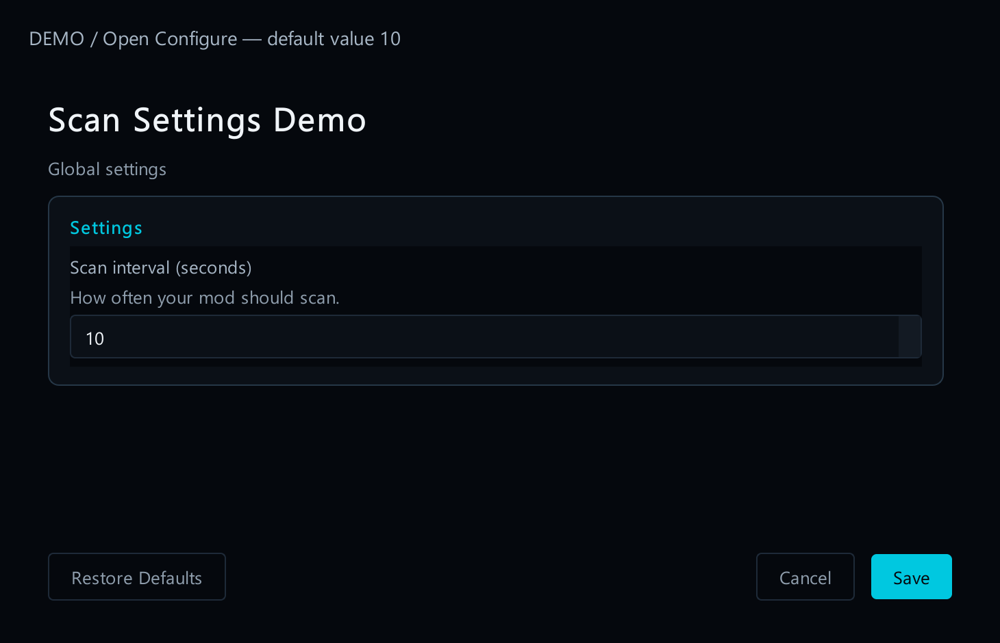

# 4. Choose form controls

[Start here](00-start-here.md)

## What each type looks like

| `type` | Player sees | Example |
| --- | --- | --- |
| `boolean` | On/off switch | Show hints |
| whole-number input | Whole-number input | 10 seconds |
| `number` | Decimal-number input | 0.5 strength |
| `string` | Text box | A profile label |
| `choice` | Drop-down list | Low / High |



[Open full-size image](images/controls.png)

*Demo form using actual launcher controls. These preferences do not change gameplay by themselves.*



[Open full-size image](images/control-boolean.png)



[Open full-size image](images/control-integer.png)



[Open full-size image](images/control-number.png)



[Open full-size image](images/control-string.png)



[Open full-size image](images/control-choice.png)

## A drop-down example

Add this field to your list of form fields array. It uses the `prefs` file declared on the [Configure page](03-configure.md). Players see **Low** or **High**; the file stores `"low"` or `"high"`.


[Open full-size image](images/control-choice.png)

Use group heading to place related fields together. Mark rarely used fields with advanced option; players reveal them with **Show advanced settings**. Forms with eight or more fields show a search box.



[Open full-size image](images/advanced-hidden.png)



[Open full-size image](images/advanced-shown.png)



[Open full-size image](images/advanced-search.png)

Give every field a valid default and useful limits. Invalid existing values produce an error rather than silently becoming defaults. See [3. Add a Configure button](03-configure.md).



[Open full-size image](images/configure-default.png)

---

## Code examples

```json
{
  "id": "quality",
  "label": "Quality",
  "type": "choice",
  "default": "high",
  "choices": [
    {
      "value": "low",
      "label": "Low"
    },
    {
      "value": "high",
      "label": "High"
    }
  ],
  "file": "prefs",
  "key": [
    "quality"
  ]
}
```
