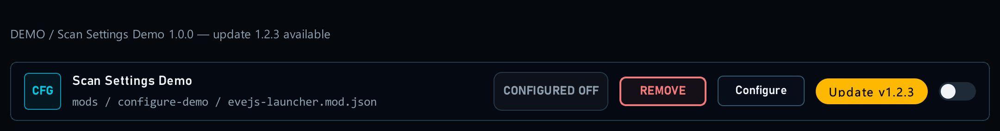
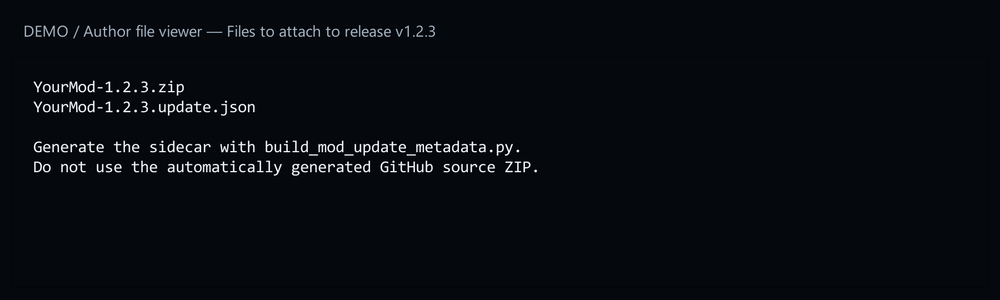
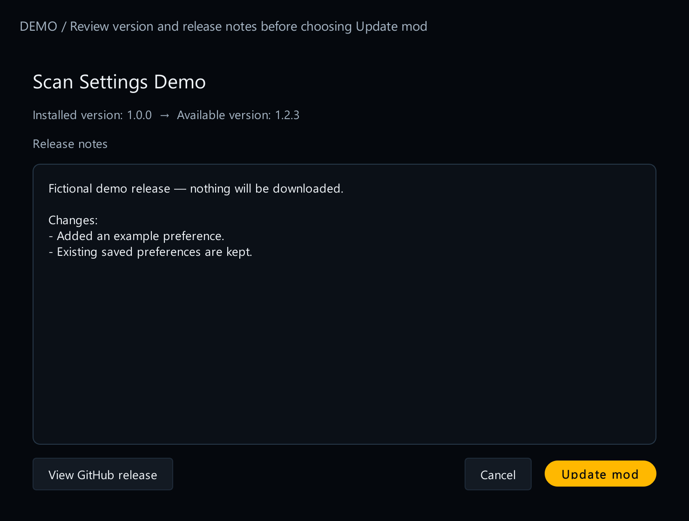

# 7. Offer mod updates

[Start here](00-start-here.md)

## What the player sees

When a compatible newer release exists, Mods shows an update button and a gold count badge. The player can read the release notes and choose whether to install it. Checking for updates does not install anything.

## What you add

Add `updates` to the existing schema-3 manifest. Replace this example repository and filename with your own:



[Open full-size image](images/update-available.png)

*Actual launcher widgets, fictional update. The gold **Update v1.2.3** button belongs to this mod. Clicking it opens the review before installation. The Configure button beside it changes settings; the switch controls activation.*

## Publish the new version

The update button needs two downloadable files on your GitHub release: your mod ZIP and a small information file ending in `.update.json`. That second file tells the launcher which mod and version it is downloading and lets it check the ZIP. The included packaging program creates it from the ZIP; the next chapter explains how.



[Open full-size image](images/release-files.png)

Follow [14. Publish a mod update](14-publish-update.md). It explains both files and the check before you publish.

## Try it



[Open full-size image](images/update-review.png)

Open the offered update, read the version and release notes, then choose Cancel. Nothing should be installed. After installing a real update in a test copy, check that your saved preferences remain.

---

## Code examples

```json
"updates": {
  "provider": "github",
  "repository": "your-name/your-mod",
  "asset": "YourMod-{version}.zip",
  "channel": "stable",
  "tagPrefix": "v",
  "preserveFiles": []
}
```
