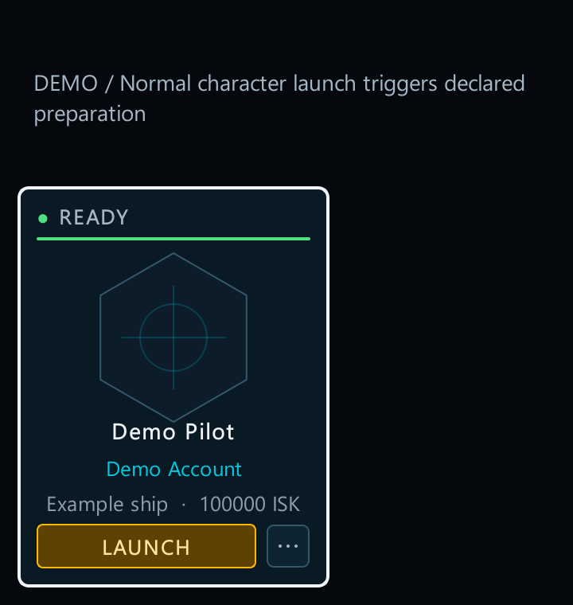
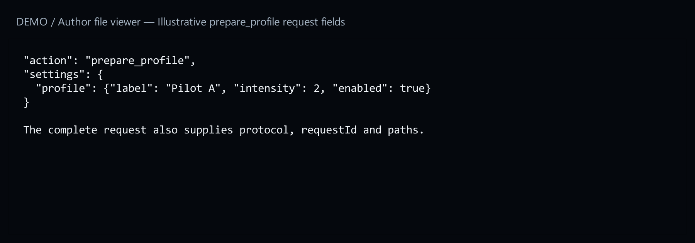
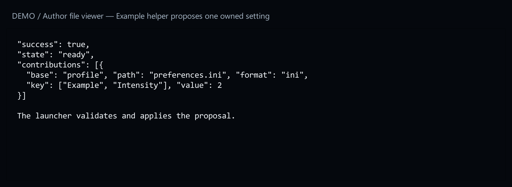
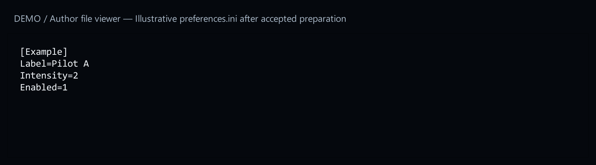

# 8. Add a helper when needed

[Start here](00-start-here.md)

## When you need this

A Configure form can save values without a helper. Add a helper only when your mod needs executable preparation: for example, converting a saved preference into profile settings before EVE starts.


[Open full-size image](images/configure-default.png)

## What the player sees

The player uses the normal mod or launch action. The launcher runs the declared helper, checks its reply and shows any failure. There is no arbitrary script button to add to the form.



[Open full-size image](images/helper-launch.png)

The example below declares only `prepare_profile`. It belongs in an existing schema-3 manifest.



[Open full-size image](images/helper-request.png)

## Use a complete working example

Get `profile-options` from [15. Example files](15-example-files.md). This example turns a saved preference into a setting used when a profile starts. The helper receives the chosen values and sends back its proposed changes. The launcher checks those changes before saving them.


[Open full-size image](images/helper-request.png)



[Open full-size image](images/helper-reply.png)

Use the paths supplied by the launcher. Request shared setting changes through contributions so the launcher can track ownership and restore them later. Do not replace whole shared files to change one key.



[Open full-size image](images/helper-result.png)

Test success, failure and cancellation in a disposable setup.


[Open full-size image](images/helper-failure.png)

---

## Code examples

```json
"launcherApi": {
  "version": 1,
  "minLauncherVersion": "1.0.53",
  "helper": {"runtime": "node", "path": "helper.js"},
  "capabilities": ["prepare_profile"]
}
```
