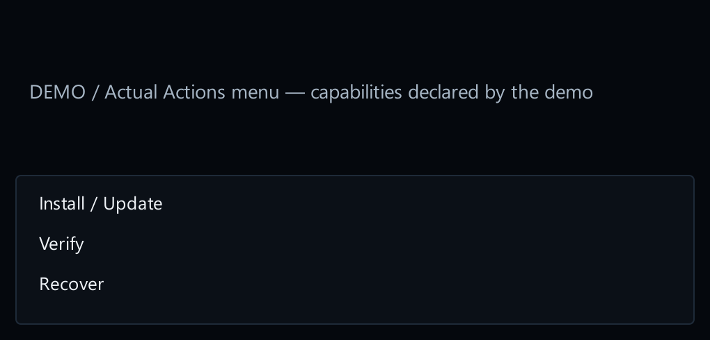

# 12. Support client file mods

[Start here](00-start-here.md)

## What the player sees

A client package can offer Install / Update, Verify and Recover through its Actions menu when those capabilities are declared. Before launching a client, the launcher verifies the enabled package. Installing shared files and changing one character’s preferences are separate operations.

[Open full-size image](images/client-actions.png)

## Build from the receipt example

Get `client-receipt-demo` from [15. Example files](15-example-files.md). It demonstrates how a mod records what it installed, checks it, and cleans up. It does not install a graphics upgrade. A real graphics mod must also check the game version and keep the original files so it can restore them.

[Open full-size image](images/client-receipt.png)

Keep shared binary installation global to the physical client. Store character preferences in profile data. Never install shared binaries from `prepare_profile`. [8. Add a helper when needed](08-helper-intro.md).

[Open full-size image](images/storage-locations.png)
