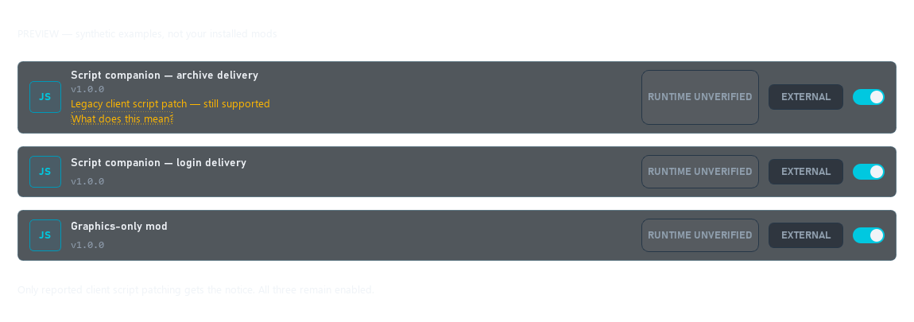
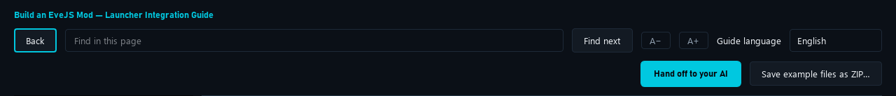

# 12. Support client file mods

[Start here](00-start-here.md)

## What the player sees

A client package can offer Install / Update, Verify and Recover through its Actions menu when those capabilities are declared. Before launching a client, the launcher verifies the enabled package. Installing shared files and changing one character’s preferences are separate operations.

[Open full-size image](images/client-actions.png)

## Build from the receipt example

Get `client-receipt-demo` from [15. Example files](15-example-files.md). It demonstrates how a mod records what it installed, checks it, and cleans up. It does not install a graphics upgrade. A real graphics mod must also check the game version and keep the original files so it can restore them.

[Open full-size image](images/client-receipt.png)

Keep shared binary installation global to the physical client. Store character preferences in profile data. Never install shared binaries from `prepare_profile`. [8. Add a helper when needed](08-helper-intro.md).

[Open full-size image](images/storage-locations.png)

## Prefer login delivery for client companions

Prefer delivery through a reviewed EveJS login path for new client companions when the server supports it. This avoids keeping a client archive patched. Existing mods do not have to migrate immediately, and migration must preserve their compatibility. This is a mod-author integration, not a new Launcher API or an automatic conversion of other mods.

The Launcher runs the declared update, cleanup and installation actions. The author provides the companion, checks compatibility, waits for character login, handles reconnects and removes old handlers. Keep only one delivery method active.

Before release, test old and new mod versions sharing one physical client, backend changes and rollback. Restoring an archive entry can break an older installation that still needs it. Do not repair shared files from `prepare_profile`; use the installation lifecycle. See the [helper guide](08-helper-intro.md).

The Launcher can show “Legacy client script patch — still supported” when a helper reports that method for the selected client and backend. This is an informational notice, not a launch block. Handshake delivery, graphics-only mods and unreported methods do not receive that warning. Authors can opt into the reporting contract in the helper reference.

## Legacy client script patches

This notice means the mod reported changing client scripts on disk for the selected client and backend. That method remains supported. Login-handshake delivery is preferred for new client companions where the EveJS server supports it, because the authored companion can load at login without keeping the client archive modified. Graphics/DLL changes are outside this notice.

[Open full-size image](images/legacy-delivery-notice.png)

*Actual Launcher widgets with fictional mods. The legacy notice includes a help link; all three examples remain enabled. This is a staged preview, not an installed-mod inventory.*

### If you use the mod

Keep using it normally. When its author publishes a compatible migration update, close the client and stop the server, then use the mod’s normal Update button in the Launcher. Follow the author’s supported-version instructions. Do not delete client files, receipts or backups yourself. If no migration update exists, the author needs to provide one; this notice has no switch that converts the mod automatically.

### If you make the mod

Move your authored client companion into a reviewed EveJS login integration. Preserve the existing login behavior, wait for character readiness, and handle reconnects and duplicate handlers. This requires author code; renaming a manifest field does not migrate a mod.

Provide a normal update that restores only your verified old patch through the installation lifecycle, preserves settings and unrelated mods, and can roll back. Account for older installations sharing the physical client before removing a companion they still need. Test backend changes, both delivery methods, disable/remove, reconnect and failed updates. Do not move archive writes into profile preparation.

Report the method actually selected using the optional helper contract. A working handshake path reports `login-handshake`; an archive fallback still reports `client-script-patch`. The notice disappears after a successful report of the changed method and a Mods refresh. Never report handshake merely to hide the notice. Use the helper guide and its technical reference for the contract. Existing mods may retain legacy delivery while a compatible migration is being prepared.

## Automatic preparation with Launcher 1.0.61

Authors can opt into a separate step before launch: verify the selected setup, install a missing compatible companion if necessary, then verify again. It uses the normal install action; profile preparation still cannot write shared archives. Healthy additional client launches do not reinstall anything. Close running clients before replacing shared client files.

The author declares tested older mod versions that may share the client and requires Launcher 1.0.61 for the migrating update. Update the Launcher first, then the mod. Existing mods keep their behavior unless explicitly enrolled. The AI handoff includes the exact helper contract. The legacy notice itself does not enable automatic preparation.

## AI handoff for migration

Use **Hand off to your AI** on this page to copy the dedicated migration prompt together with this chapter, the helper/ownership contracts and the receipt example. On GitHub, use the prompt linked below and attach your mod source. The prompt asks for automatic upgrades, preserved settings, both delivery paths, shared-client compatibility and honest test coverage. It does not authorize a live install or publication.

[Open full-size image](images/ai-handoff-toolbar.png)

*Actual guide toolbar. Hand off to your AI copies the current topic and its attached files; Save example files as ZIP exports the examples.*

---

## Code examples

[AI handoff: migrate client scripts to login delivery](../../examples/login-delivery/AI-HANDOFF.md)
