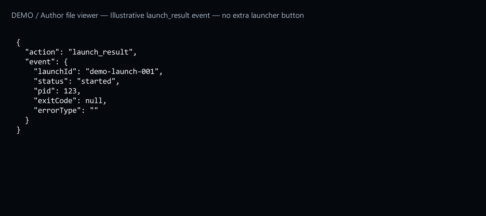
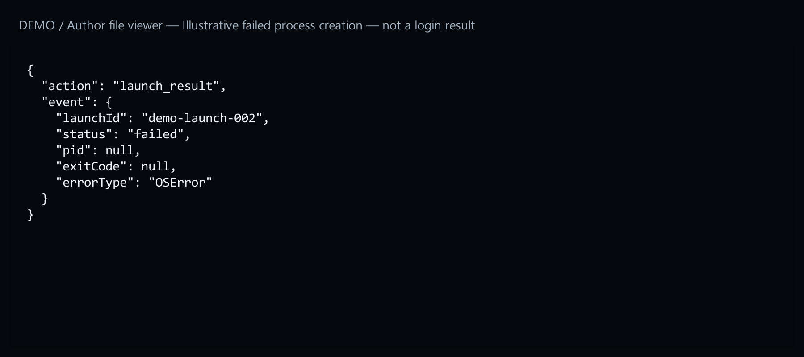

# 13. React to client start and exit

[Start here](00-start-here.md)

## What the player sees

These are background notifications for your helper. They do not add a button or prove a successful game login. `launch_result` reports whether the process started; `client_exit` reports that same process’s exit code while the launcher remains open.



[Open full-size image](images/event-started.png)


[Open full-size image](images/event-exited.png)

## What you declare

Add either capability to the existing list of helper tasks list. Preserve capabilities your helper already needs. Both events share an opaque `launchId` so your helper can match a start with its exit. Notifications cannot change an already submitted launch.


[Open full-size image](images/event-started.png)

## Example result

A started process followed by exit code `0` gives your helper two matched events. A failed spawn reports an exception type, not credentials or a command line. [8. Add a helper when needed](08-helper-intro.md).


[Open full-size image](images/event-started.png)


[Open full-size image](images/event-exited.png)



[Open full-size image](images/event-failed.png)

---

## Code examples

```json
"capabilities": ["launch_result", "client_exit"]
```
