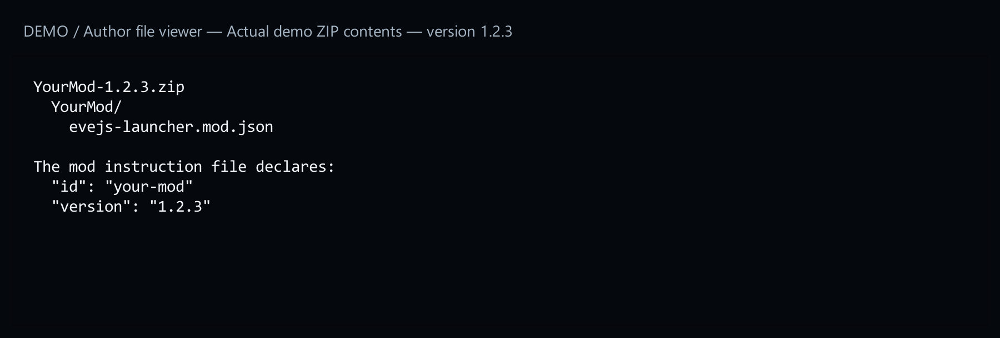
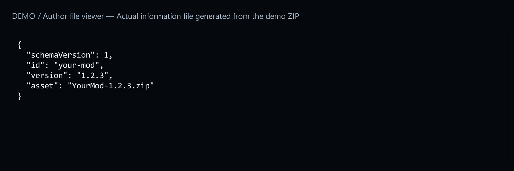
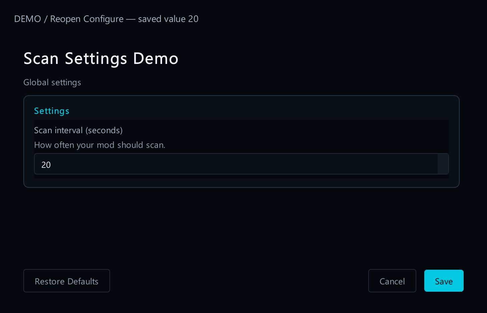

# 14. Publish a mod update

[Start here](00-start-here.md)

A release is a downloadable version of your mod on GitHub. The launcher reads it to offer the update button. You publish your mod; you do not need to change the launcher. The version 1.2.3 below is an example.


[Open full-size image](images/update-available.png)

1. Prepare the mod ZIP. Its name and the version inside the mod must agree: for this example, use `YourMod-1.2.3.zip` and version 1.2.3. First check that this ZIP imports and works in a spare test installation.



[Open full-size image](images/release-zip.png)

2. Create the small update information file. It tells the launcher the mod name, version and ZIP filename. The included `build_mod_update_metadata.py` program creates it from your ZIP. Get the program from [15. Example files](15-example-files.md). It needs Python installed. In the folder containing both files, open a terminal and run the command under “Code examples”. It creates `YourMod-1.2.3.update.json` beside the ZIP. Opening the program as text does not run it.



[Open full-size image](images/release-information.png)

3. Create a GitHub release in the repository named by your mod. For version 1.2.3, use the tag `v1.2.3`. Attach BOTH files: `YourMod-1.2.3.zip` and `YourMod-1.2.3.update.json`. Write a short list of changes. GitHub’s automatic “Source code” downloads do not replace your mod ZIP.


[Open full-size image](images/release-files.png)

4. Check the player’s experience in a spare installation with an older version. Use Check mod updates, open the offered update and check the version and notes. Cancel once to check that nothing installs. Then update the test copy and confirm that your saved settings still work. Publish only a real version you have tested.


[Open full-size image](images/update-review.png)



[Open full-size image](images/configure-reopened.png)

---

## Code examples

```powershell
python build_mod_update_metadata.py YourMod-1.2.3.zip
```
