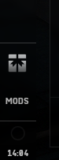
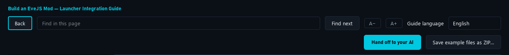

# 17. Share an in-game Mods menu

[Start here](00-start-here.md)

## One icon for participating mods

The Launcher supplies one generic **Mods** icon in the native Neocom and a separate top-level **MODS** category in native Insider. AutoMining is not required. Insider keeps its account restrictions; ordinary players can use Neocom. The menu hides when no usable entries remain.



[Open full-size image](images/shared-mods-neocom.png)

## Opt in and register

Use manifest schema 3, a loader with `loader_rename`, `game_server` restart, and `clientMenu` below. Its entrypoint is a relative UTF-8 Python 2.7 file, at most 128 KiB. Metadata never evaluates an opener expression. The Launcher delivers this trusted mod script from the selected profile's frozen enabled selection through the server login payload, in Native and Managed Docker. It does not modify `code.ccp` or search for more mods later.

The API exists before entrypoints run. The framework waits for a character, then executes each entrypoint in its own namespace. Your script registers its manifest ID, localized labels and a real opener callback. IDs normalize to lowercase. Supply `en` as fallback; the client language chooses the label. Registration does not open the window. The complete example below creates a native mod window; its opener calls `ModWindow.Open()`.

## Update and cleanup

Repeated `register` replaces the same ID. Use `registration.update(labels, opener)` to update, and `registration.close()` to remove it safely. Module-level `update(id, labels, opener)` and `unregister(id)` also exist. Optional `is_available` must be a quick callback: false hides an entry while its companion is not ready. A failed callback hides that entry and logs a diagnostic; other mods keep working. Update or register again to clear the failure.

An optional `cleanup()` runs on logout, character change and bootstrap replacement. Close your own windows, tasks and listeners there. Reconnect creates fresh registrations; UI reload and duplicate registration must leave one icon. Disabling a mod requires server restart and client reconnect: a running frozen plan does not change underneath clients.

## Compatibility and checking

Requires **Launcher 1.0.69 or newer, menu API 1**, EVE **build 3396210 / Python 2.7** and the reviewed EveJS **0.12.9** login builder. Other EveJS versions keep their existing launch paths when no mod opts in; their shared-menu delivery is not yet verified. Connect-only Docker cannot deploy a preload on a remote server. The Native Neocom button was checked in-game. Managed Docker delivery has offline launch-plan checks; verify it in your own environment.

Use the complete example and its AI handoff. Check one test mod without AutoMining, two entries sharing one icon, opening, relogin, duplicate registration, disable/restart, ordinary-player Neocom and elevated Insider. Save the example files as ZIP or copy this page's handoff.

The picture below shows the guide toolbar; it is not evidence of an in-game Mods icon.



[Open full-size image](images/ai-handoff-toolbar.png)

---

## Code examples

[README](../../examples/shared-menu/README.md) · [AI-HANDOFF.md](../../examples/shared-menu/AI-HANDOFF.md)

```json
{
  "schemaVersion": 3,
  "id": "author.menu-demo",
  "displayName": "Example shared menu mod",
  "version": "1.0.0",
  "kind": "loader",
  "supportedBackends": ["native", "docker"],
  "activation": {"strategy": "loader_rename"},
  "restart": "game_server",
  "clientMenu": {"apiVersion": 1, "entrypoint": "menu.py"}
}
```

```javascript
// loader.js (renamed from loader.js.disabled when enabled)
"use strict";
console.log("EXAMPLE_SHARED_MENU:LOADED");
```

```python
# -*- coding: utf-8 -*-
# Complete, self-contained Python 2.7 client entrypoint for author.menu-demo.
import evejs_mod_menu as mods
from carbonui import uiconst
from carbonui.control.window import Window
from eve.client.script.ui.control.eveLabel import EveLabelMedium


class ModWindow(Window):
    default_windowID = 'AuthorMenuDemoV1'
    default_caption = 'Example mod'
    default_width = 320
    default_height = 180
    default_scope = uiconst.SCOPE_INGAME

    def ApplyAttributes(self, attributes):
        Window.ApplyAttributes(self, attributes)
        EveLabelMedium(parent=self.content, align=uiconst.TOTOP,
                       text='This window belongs to your mod.')


def open_window():
    ModWindow.Open()


registration = mods.register('author.menu-demo',
    {'en': 'Example mod', 'nl': 'Voorbeeldmod'}, open_window, api_version=1)


def cleanup():
    registration.close()
    ModWindow.CloseIfOpen()
```
