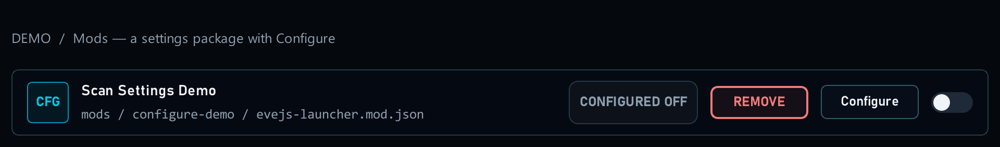
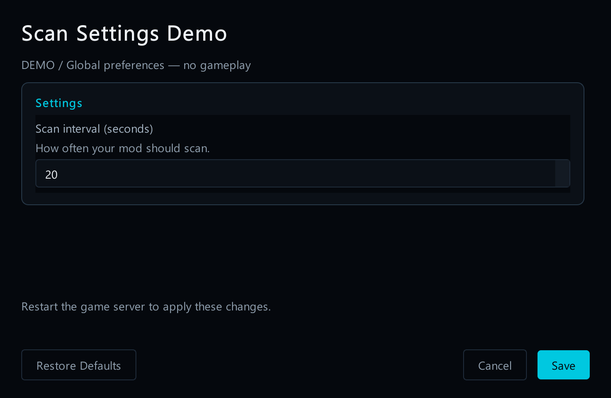
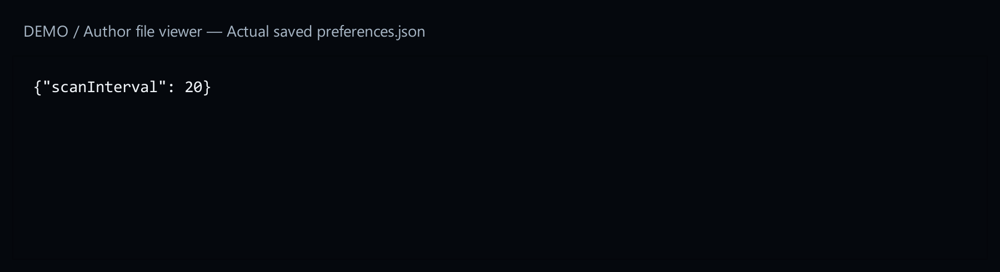

# 3. Add a Configure button

[Start here](../MOD_AUTHORING.md)

## What the player sees

**Configure** opens your mod’s settings window. The launcher builds this window from the settings described in your mod’s instruction file. You choose the questions and values; you do not have to design or program a window.



[Open full-size image](images/configure-row.png)

*Real launcher row, fictional demo mod. Configure edits preferences; the separate switch enables or disables the mod.*

## How the code becomes a screen

- Give the setting a clear name so players know what it changes.
- This example accepts whole numbers from **1 to 300**.
- It starts at **10** when the player has not saved a value yet.
- Clicking Save writes the chosen number into `preferences.json` in the mod folder.
- The mod must read that file to use the chosen number.
- A reminder explains when a server restart is needed. Saving does not restart the server.



[Open full-size image](images/configure-dialog.png)

*Real settings window. The example changes 10 to 20. The screenshot uses English labels; the explanation can be read in your chosen language.*

## Check the result


1. Import the complete demo and open **Configure**.


[Open full-size image](images/configure-default.png)


2. Change **10** to **20**.


[Open full-size image](images/configure-dialog.png)


3. Click **Save**. Open `preferences.json`: the saved scan interval is **20**.



[Open full-size image](images/saved-preferences.png)


4. Close and reopen Configure. It should still show **20**.


[Open full-size image](images/configure-reopened.png)


5. Try another value, then click **Cancel**. Reopen the form: the saved value is still **20**.


[Open full-size image](images/configure-reopened.png)

The launcher saves a preference. Your own mod code must read it and use it; this demo does not perform scans. A helper is not needed just to show the form or save values.


[Open full-size image](images/saved-preferences.png)

No button? Check that the package has a valid schema-3 manifest and a valid, nonempty settings form declaration.


[Open full-size image](images/configure-row.png)

---

## Code examples

## What you add

Add this settings form property inside your existing **schema-3** `evejs-launcher.mod.json`. This is a manifest fragment, not a complete file. Do not change the manifest’s own `schemaVersion: 3`; the settings object has its own `schemaVersion: 1`.

```json
"settings": {
  "schemaVersion": 1,
  "files": [
    {
      "id": "prefs",
      "base": "mod",
      "path": "preferences.json",
      "format": "json"
    }
  ],
  "fields": [
    {
      "id": "scanInterval",
      "label": "Scan interval (seconds)",
      "description": "How often your mod should scan.",
      "type": "integer",
      "default": 10,
      "minimum": 1,
      "maximum": 300,
      "restart": "game_server",
      "file": "prefs",
      "key": [
        "scanInterval"
      ]
    }
  ]
}
```
