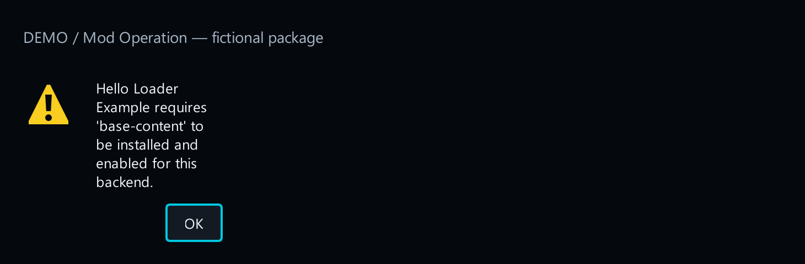
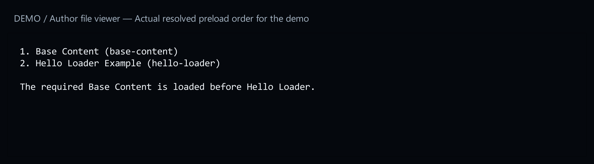

# 10. Dependencies and load order

[Start here](../MOD_AUTHORING.md)

## What the player sees

If your mod needs another mod, the launcher explains which prerequisite is missing or disabled. It blocks incompatible pairs and reports ordering cycles before startup. It does not silently disable another mod.



[Open full-size image](images/dependency-missing.png)

## What you add

Add these optional fields to the manifest. Use real mod IDs. `requires` needs an installed, enabled, valid mod. `loadAfter` and `loadBefore` order loader preloads only; absent targets are ignored. `conflicts` prevents the pair from being enabled together.



[Open full-size image](images/dependency-order.png)

## Try it

Enable the dependent mod without its prerequisite: the launcher should name the missing mod. Then install and enable the prerequisite and retry. [1. Make your first package](first-mod.md).


[Open full-size image](images/dependency-missing.png)


[Open full-size image](images/dependency-order.png)

---

## Code examples

```json
"requires": ["base-content"],
"loadAfter": ["mining-rules"],
"loadBefore": ["final-overlay"],
"conflicts": ["alternative-overhaul"]
```
