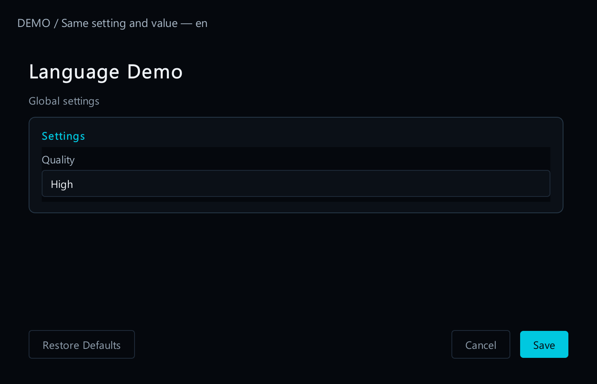
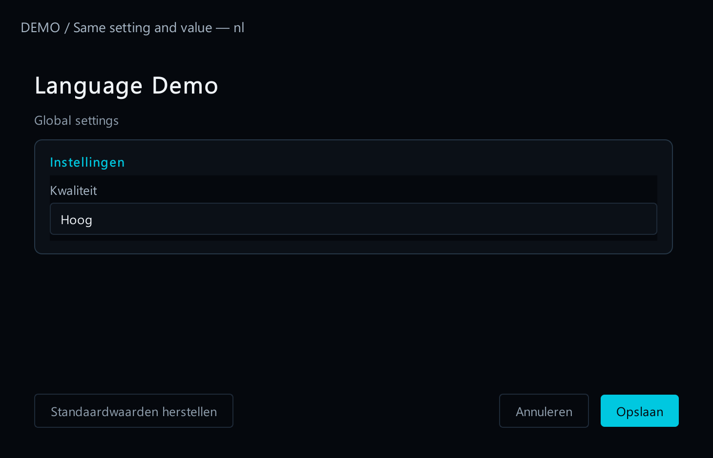
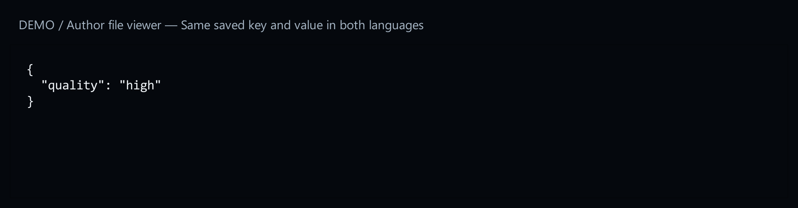

# 6. Translate setting labels

[Start here](../MOD_AUTHORING.md)

## What the player sees

An English player sees **Quality**. A Dutch player sees **Kwaliteit**. Both edit the same setting and save the same value.



[Open full-size image](images/language-en.png)



[Open full-size image](images/language-nl.png)

## What you add

Replace a field’s plain field name with a language map. Always include `en` as the fallback. This is a fragment inside a field:


[Open full-size image](images/language-nl.png)

You can translate `description`, group heading and choice labels the same way. Keep permanent mod identifier, saved setting name, file paths, enum names and stored values unchanged. For example, the stored value `"high"` stays `"high"` in every language.



[Open full-size image](images/language-value.png)

The launcher does not automatically translate text written by your mod. Supply the translations you want to offer. English-only text is valid.


[Open full-size image](images/language-en.png)

## Check it

Change the launcher language, reopen Configure, and check the labels. Change a value and confirm the saved keys are unchanged. The language selector in this guide changes only the guide; it does not change the launcher’s language or your mod settings.


[Open full-size image](images/language-nl.png)


[Open full-size image](images/language-value.png)

---

## Code examples

```json
"label": {
  "en": "Quality",
  "nl": "Kwaliteit",
  "fr": "Qualité",
  "de": "Qualität",
  "ru": "Качество",
  "zh_CN": "质量",
  "ja": "品質",
  "ko": "품질"
}
```
