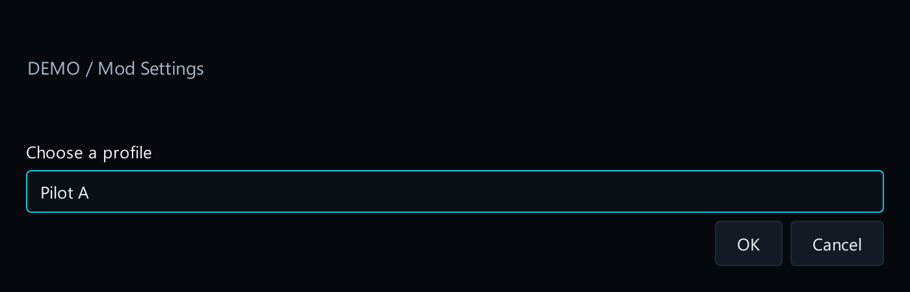
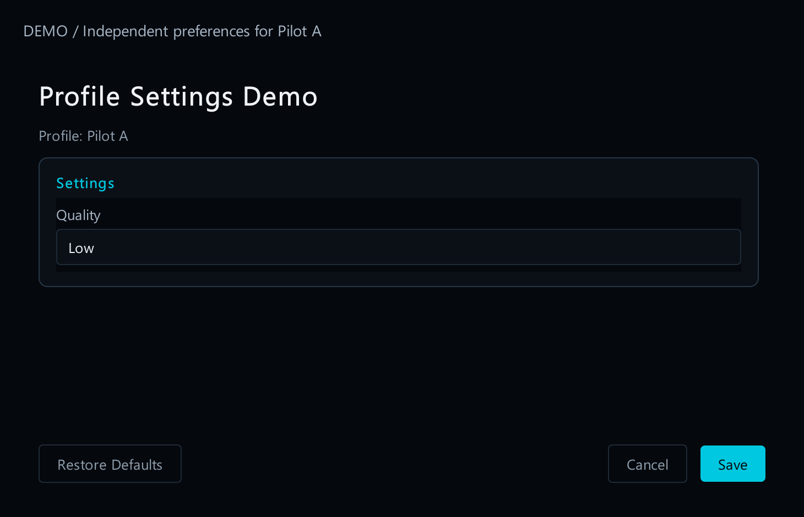
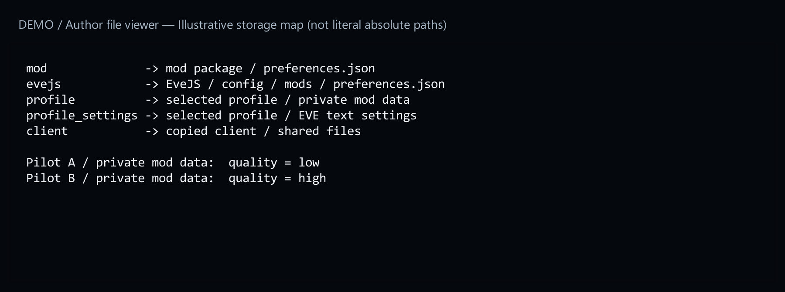
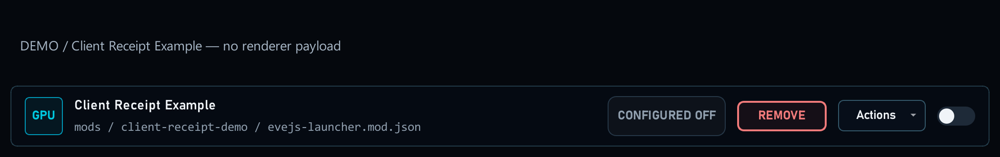
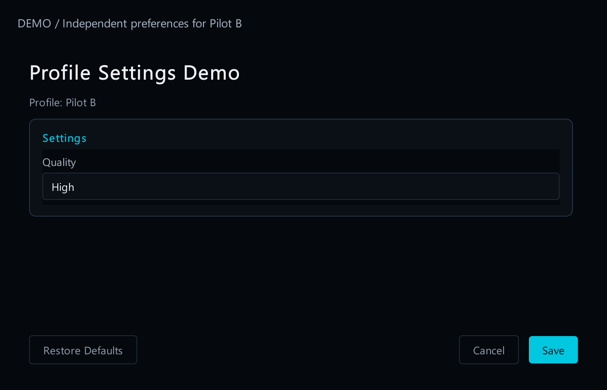

# 5. Separate settings by profile

[Start here](../MOD_AUTHORING.md)

## What the player sees

When a form uses profile storage, the launcher asks which character profile to edit. **Pilot A** can use quality **Low**, while **Pilot B** uses **High**. Saving one profile must not change the other.



[Open full-size image](images/profile-picker.png)

## What you change

Use `base: "profile"` in your settings file declaration. The rest of the form works as before.



[Open full-size image](images/profile-a.png)

## Choose the right location

- `mod`: one file in the mod package; shared by its users.
- `evejs`: a server configuration file; its path must start with `config/`.
- `profile`: private data for this mod and this profile.
- `profile_settings`: the selected profile’s actual EVE text settings. Use only known supported keys.
- `client`: the physical copied client; shared by profiles using that client.



[Open full-size image](images/storage-locations.png)

A profile is not a separate installation of renderer DLLs. Binary installation remains shared. Do not mix server-coordinated and client-coordinated files in one form.



[Open full-size image](images/client-row.png)

## Check it

Save different values for two profiles, then reopen both. For a complete profile example, see [15. Example files](example-files.md).


[Open full-size image](images/profile-a.png)



[Open full-size image](images/profile-b.png)

---

## Code examples

```json
{
  "id": "prefs",
  "base": "profile",
  "path": "preferences.json",
  "format": "json"
}
```
