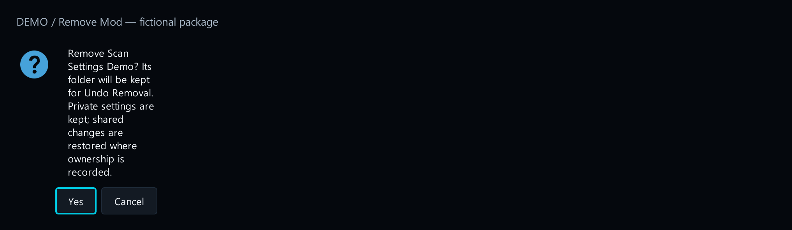
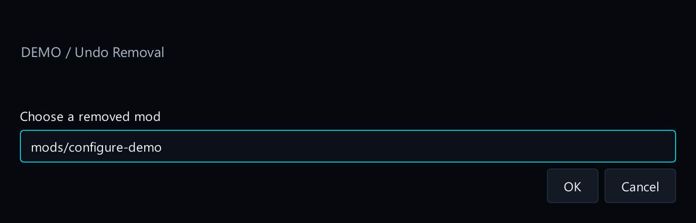
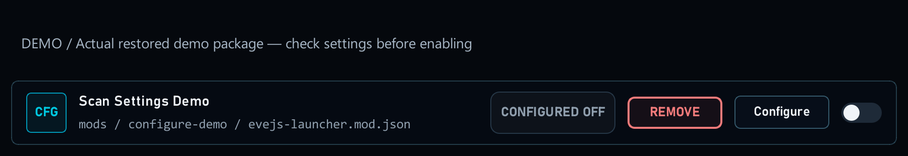
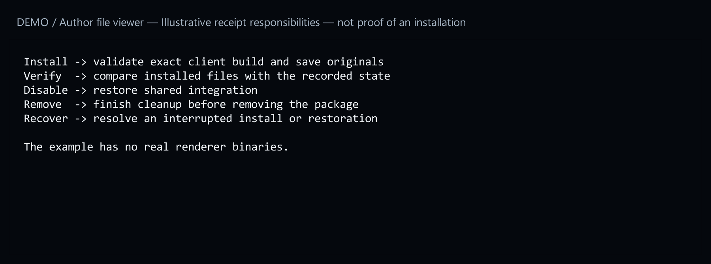
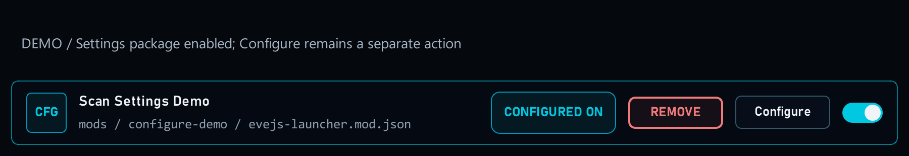
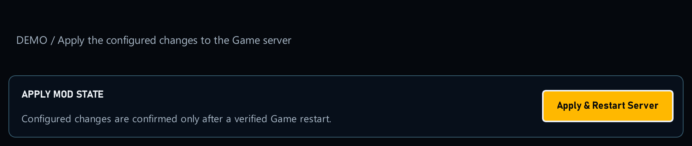
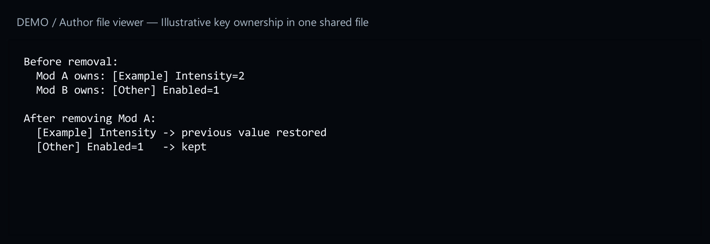

# 9. Remove and recover

[Start here](../MOD_AUTHORING.md)

## What the player sees

Disabling a mod changes whether it should run; it keeps the package. Removing a launcher-owned local package moves it out of the active mod folder into recoverable storage. **Undo Removal** can bring it back.

[Open full-size image](images/remove-confirm.png)

[Open full-size image](images/undo-removal.png)

If the launcher does not own the package, it may offer **Adopt** first. Unknown or externally changed files can require repair instead of automatic removal.

[Open full-size image](images/restored-mod.png)

## What the author provides

An ordinary local package uses the launcher’s package management. A mod that installs client binaries or changes source files also needs its own verified cleanup and recovery logic. A manifest alone does not make those changes reversible.

[Open full-size image](images/client-receipt.png)

## Check it in a disposable installation

1. Import and enable your mod; make one setting change.

[Open full-size image](images/settings-enabled.png)

[Open full-size image](images/configure-dialog.png)

2. Disable it and perform the required restart. Confirm its behaviour stops.

[Open full-size image](images/loader-disabled.png)

[Open full-size image](images/apply-restart.png)

3. Remove the package. Check that unrelated files and other mods still work.

[Open full-size image](images/remove-confirm.png)

4. Restore it. Check the expected saved preferences and activation state before enabling it again.

[Open full-size image](images/undo-removal.png)

[Open full-size image](images/restored-mod.png)

Shared settings should use owned key contributions. On removal, the launcher can remove your contribution without deleting another mod’s unrelated keys.

[Open full-size image](images/owned-settings.png)
