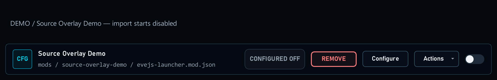
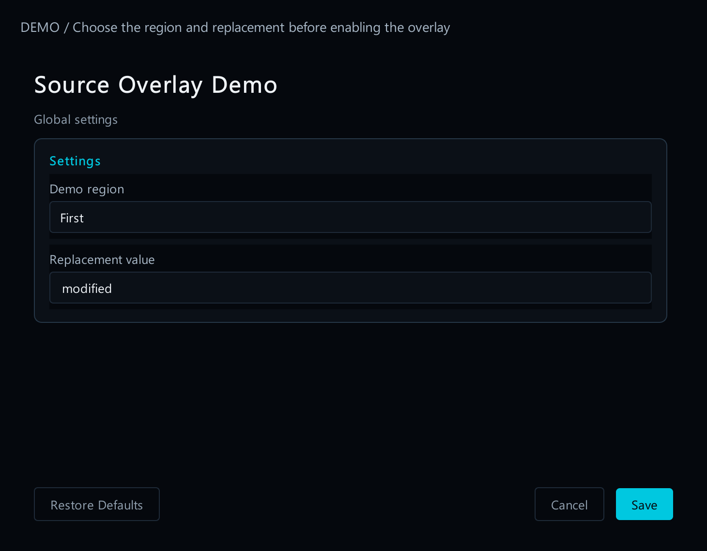
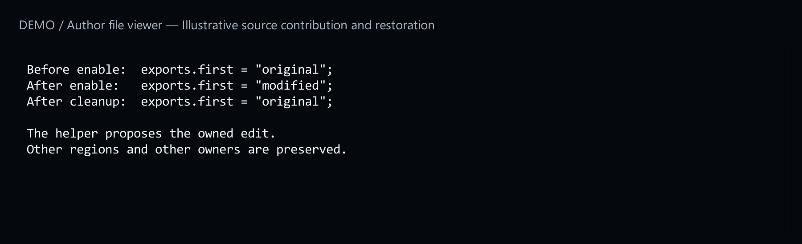

# 11. Integrate server source files

[Start here](../MOD_AUTHORING.md)

## What the player sees

A source integration can have its own Mods row, toggle and Configure form. A packaged overlay starts disabled. Enabling runs its declared installer before recording the enabled state; disabling or removing runs cleanup. Undo restores it disabled.

[Open full-size image](images/source-row.png)

## Start from a working example

Get `source-overlay-demo` from [15. Example files](example-files.md). Try it only in a spare test installation. Its form lets you choose which example section to change and the replacement text. It demonstrates changing one owned part of a server file and restoring it later.

[Open full-size image](images/source-options.png)

An existing source patch can use on/off value in a settings file instead. The mod must check its enabled flag before creating entities, timers or other effects. [1. Make your first package](first-mod.md).

[Open full-size image](images/source-files.png)
